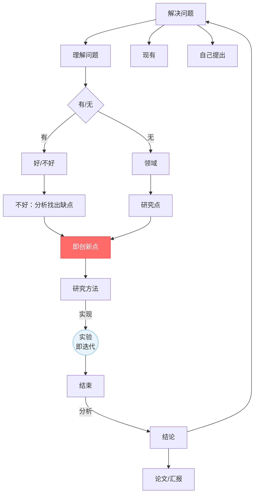
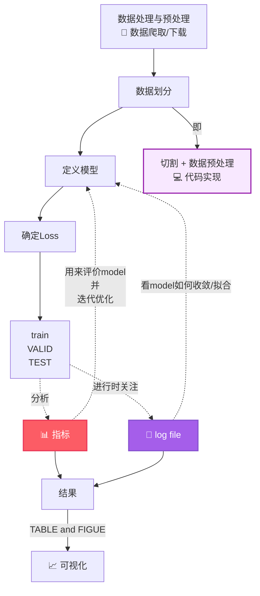

# 第二次培训学习报告


> **课程**：研究生培训课
> **提交格式**：Markdown
> **作业内容**：Course Review and Overview of Research Directions/ Fundamentals and Models of Machine Learning and Deep Learning/ Coding-Practice / Git-Practice/Linux_plus/AI Models and Their Classification-Regression Essence/matlab
> **报告人**：刘欣雨


---

第一部分：课堂知识回顾

---

## 一、工具简述

主要讲述了**Git**、**GitHub**以及**Linux**的基本操作，详见本次作业04和05部分。🖊

---

## 二、科研闭环与AI实验体系

### 2.1 科研闭环


*图1*


### 2.2 三类迭代
  
  ```mermaid
  flowchart LR
    A[小循环<br/>调参修bug] --> B[中循环<br/>方法设计 ↔ 实验证据] --> C[大循环<br/>问题本身重新定义]
    
    style A fill:#e8f4fd,stroke:#66b3ff
    style B fill:#fff3e0,stroke:#ffb347
    style C fill:#ffe8e8,stroke:#ff6b6b
  ```
  *图2*
>三个圈从小到大，颜色从蓝到橙到红，表示循环越来越大、回退代价越来越高。

### 2.3 实验体系六要素

| 要素 | 一句话 | 关键陷阱 |
|------|--------|---------|
| Dataset | 定义模型面对的世界 | 数据泄漏：测试集信息"漏"进训练 |
| Model | 研究假设的载体 | 容量大≠方法好，可能只是参数多 |
| Training | 优化参数的过程 | 超参数要公开，保证可复现 |
| Validation | 选模型调超参 | 频繁使用→对验证集过拟合 |
| Testing | 最终独立评估 | 只跑一次，不再根据结果改模型 |
| Metrics | 把"好"变成数字 | 指标要和研究目标一致 |

*表格2.3*

>辅以**Baseline**（最强对比）、**Ablation**（模块贡献）、**Parameter Setting** (参数对比)、**Reproducibility**（可复现）

---

## 三、科研核心能力
 
分别为：编程能力、代码复现能力、数据处理能力、工具使用能力、结果分析能力、文献阅读能力、写作能力和算法分析能力。

- **将八大能力体现在科研闭环中：**
<center>


 ```mermaid
 flowchart TD
    A[📚 文献阅读能力<br/>📖 实验复现能力] -->|找到创新点·立意| B[🔧 算法分析能力<br/>📊 数据处理能力<br/>🛠️ 工具使用能力]
    B -->|研究方法·实验| C[📊 数据处理能力<br/>📈 结果分析能力]
    C -->|得到结果| D[✍️ 写作表达能力]
    D -->|转化论文| E[📄 论文]
```
</center>
*图*

### 3.1 编程能力

编程能力主要体现在对于python的应用上。

#### 3.1.1一套完整的人工智能代码流程


>紫色方框是主线
>常见指标详见本文档[3.5 结果分析能力](#35-结果分析能力)
>TABLE and FIGUE如何用代码制作详见本文档[第八部分：画图](#第八部分画图)


  

#### 3.1.2 实现工具（python下）


| 工具 | 用途 | 示例 |
|---|---|---|
| [Numpy](https://numpy.org/) | 纯数学运算 | `np.dot(a, b)` |
| [Scipy](https://scipy.org/) | 科学计算 | `scipy.optimize.minimize()` |
| [Pytorch](https://pytorch.org/) | 深度学习 | `torch.nn.Linear(128, 64)` |

```python
import numpy as np
import scipy
import torch

# Numpy：矩阵乘法
a = np.array([[1, 2], [3, 4]])
b = np.dot(a, a)  # [[7,10],[15,22]]

# Scipy：求最小值
from scipy.optimize import minimize
res = minimize(lambda x: x**2 + 1, x0=0)

# Pytorch：定义模型
model = torch.nn.Sequential(
    torch.nn.Linear(128, 64),
    torch.nn.ReLU(),
    torch.nn.Linear(64, 10)
)
```


#### 3.1.3 人工智能的数据类型

AI 里计算量大，数字的**存储精度**直接影响速度和显存，所以有多种数据格式：

---

- **数值精度**（从粗到细）

| 类型 | 位数 | 范围 | 通俗理解 |
|------|------|------|---------|
| **int8** | 8 bit | -128~127 | 只能存整数，省空间 |
| **int16** | 16 bit | -32768~32767 | 整数范围更大 |
| **FP16** | 16 bit | ±65504 | 小数位少，快但不够精 |
| **FP32**  | 32 bit | ±3.4×10³⁸ | 默认精度，准但慢 |
| **BF16** | 16 bit | ±3.4×10³⁸ | FP16的变种，范围大精度低 |
| **BF32** | 32 bit | — | BF16的扩展版 |

> - **类比**：FP32 像用厘米量东西很精确，FP16 像用米量够用但粗糙，int8 像只记整数连小数都不要。
> - **BF16 为啥存在？**  FP16 数值范围太小容易溢出（超过65504就炸），BF16 牺牲小数精度换取和 FP32 一样大的范围，训练更稳。现在 GPU 训练大模型基本都用 BF16。

---

- **数据结构**（从简单到复杂）

```python
import torch

# 标量：一个数
a = torch.tensor(3.14)          # 形状 []

# 向量：一维数组
b = torch.tensor([1, 2, 3])     # 形状 [3]

# 矩阵：二维表格
c = torch.tensor([[1,2],[3,4]]) # 形状 [2, 2]

# 张量：多维数组（AI的核心数据结构）
d = torch.randn(2, 3, 4)        # 形状 [2, 3, 4]

```

- **GPU（CUDA）**

CPU 是通用处理器，几十个核心慢慢算；GPU 有几千个核心，专门做大量简单运算（矩阵乘法），AI 训练的核心操作就是矩阵乘，所以 GPU 天然适合。
CUDA 是 NVIDIA 的 GPU 编程接口，PyTorch 里一行 .cuda() 或 .to("cuda") 就把数据搬到 GPU 上算。


### 3.2 代码复现能力

<center>

 ```mermaid
  flowchart TD
    A[有代码仅需要安装依赖] --> B[模型设计偏底层<br/>依靠第三方代码] --> C[有实现方法但没有源代码] -->D[只给出数学定义、数学方法和理论设计]
    
    style A fill:#e8f4fd,stroke:#66b3ff
    style B fill:#fff3e0,stroke:#ffb347
    style C fill:#ffe8e8,stroke:#ff6b6b
  ```

</center>
*复现难度依次递增*

### 3.3 数据处理能力

主要了解数据如何划分，以及数据泄露

#### 3.3.1 数据划分

划分|用途
:---:|:---:
训练集|学习模型参数
验证集|模型选择、超参数调整、早停
测试集|最终评估泛化能力

>- 模型的参数:分为模型参数和超参数
>>- 模型参数：模型自己学出来的,神经网络的权重偏置，训练过程中通过梯度下降自己调整，不用管。
>>- 超参数：需要人提前设定好，模型不会自己调，需要根据经验。常见的超参数有，学习率，层数，隐藏维度，Batch size, dropout率，训练轮数等。
>- 早停（Early stopping）：当验证集上的性能不再提升时，提前停止训练，防止过拟合。就像学生刷题——如果模拟考分数不再提高，继续刷也不会有更多提升，不如换方法。
>- 过拟合（Overfitting）：指模型在训练集上表现优异但测试集上表现差，因模型过于复杂或数据不足。解决过拟合需简化模型、增加数据或使用正则化。
>- 欠拟合（Underfitting）：指模型在训练集和测试集上均表现不佳，因模型过于简单或训练不足；,解决欠拟合需增加模型复杂度或优化特征。
>泛化能力（Generalization Ability）：指机器学习模型对未见过的新数据（测试集或真实应用场景中的数据）做出准确预测或分类的能力。


#### 3.3.2 数据泄露

- **常见错误**

类型|通俗解释|典型场景|如何避免
:---:|:---:|:---:|:---:
特征泄露|特征里直接或间接包含了标签信息|用"是否退款"预测"是否退货"（退款必然退货）|检查每个特征与标签的因果关系，删掉标签的未来信息
时间泄露|训练集混入了未来的数据|用7月数据预测6月销量；时间序列随机划分|严格按时间顺序切分，训练集在前、测试集在后
预处理泄露|归一化/填充时用了全量数据|用全部数据的均值做 StandardScaler，测试集信息泄露到训练中|fit 只用训练集，transform 测试集
采样泄露|同一实体的多条记录被拆到训练和测试集|同一用户的多条行为，部分训练部分测试，模型记住了用户ID|按实体（如用户ID） 划分，同一实体全部进同一集合
验证泄露|反复调参看测试集表现，测试集"退化"为训练集|调了50次超参都看测试集准确率|训练集训练→验证集调参→测试集只看一次
数据增强泄露|增强后的样本与原始样本跨集分布|对训练图片做翻转增强后，增强图和原图分到不同集合|增强只在训练集内部做，增强前后保持同一集合
特征选择泄露|选特征时用了全量数据的统计量|用全量数据的相关系数选top特征，再划分训练/测试|特征选择只在训练集上做


- **自检手册**

- [ ] 预处理（归一化、填充、编码）是否 只用训练集 fit？
- [ ]  时间数据是否 严格按时间先后划分？
- [ ]  同一实体的记录是否 全部在同一集合？
- [ ]  特征里有没有 包含标签的未来信息？
- [ ]  测试集是否 只在最终评估时用一次？
- [ ]  特征选择是否 只在训练集上做？

### 3.4 工具使用能力

python 虚拟环境 git版本控制 

### 3.5 结果分析能力

结果分析主要通过模型的指标、消融实验进行，与此同时还要考虑如何将结果展示出来

#### 3.5.1 模型的指标

该部分将在本次作业02详细说明。

#### 3.5.2 消融实验（Ablation Study）

- **核心思想**：一个模型有很多组件，逐个拆掉看效果变差多少，就能知道每个组件到底有没有用、贡献多大。


#### 3.5.3 结果可视化

格式：json csv
>用来展示表：用word和latex
>用来表示数据：matplotlib以及更高级的画图工具


### 3.6 文献阅读能力

详见培训网站资料库中：c3s2 文献阅读入门

### 3.7 写作能力

### 3.8 算法分析能力


## 四、总结

一篇论文的产出需要经历严谨的逻辑闭环以及反复的实验。做好科研至少需要掌握基础的八项能力