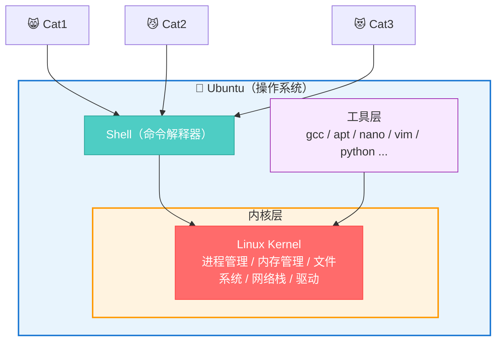
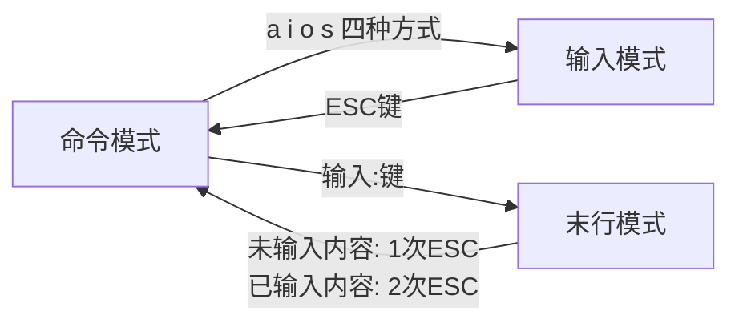
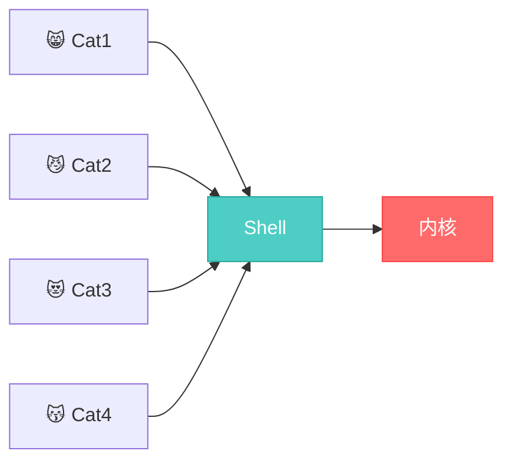

# 第三章节：虚拟系统

此部分将从大到小进行阐述：
---

- [第三章节：虚拟系统](#第三章节虚拟系统)
  - [一、Ubuntu](#一ubuntu)
  - [二、工具层](#二工具层)
  - [三、linux](#三linux)
  - [四、 Shell](#四-shell)
  - [五、实验环境](#五实验环境)


---


<br/>




## 一、Ubuntu


**`Ubuntu = Linux内核 + 工具 + Shell + 桌面`**

Linux是Ubuntu的"发动机"，Ubuntu是包着这台发动机的"整车"。
所以：
Linux ≠ 操作系统，只是内核（发动机）
Ubuntu = Linux内核 + 一堆配套软件 = 完整的操作系统（整车）
同一个Linux内核，换个壳就是另一个系统：Ubuntu、CentOS…就像同一款发动机装不同车壳


*图1.1安装Ubuntu*

>接下来的演示，都是基于ubuntu

---

## 二、工具层

### 2.1 micro的使用
micro是一个像Windows记事本一样的终端编辑器，不用记Vim那些奇怪命令。

- **基本用法**


*图2.1micros使用*


>像复制粘贴之类的操作与windows的记事本没区别，就不多加赘述了


### 2.2 VIM的使用

- **检查vim版本**


*图2.2-1检查vim版本*

<br/>

- **使用touch创建文件`touch  1.txt`**
- **使用vim打开并编辑文件`vi  1.txt`**

###### *示例*


*图2.2-2创建并编辑文件*

<br/>

- **vim的三种模式**




模式|用途|示例
:---:|:---:|:---:
命令模式|默认模式，用来执行快捷操作|删除行`dd`、复制`yy`、粘贴`p`、撤销`u`等
输入模式|写代码/文字的模式，跟记事本一样打字|🈚
末行模式|执行保存退出等命令|`:w`保存、`:q`退出、`:wq`保存退出、`:q!`强制退出

*表格2.2-1*

<br/>

- **查看文件内容`cat 1.txt`**

###### *示例*


*图2.2-3查看文件内容*


<br/>

- **显示行号在末行模式下：`set nu`**

###### *示例*


*图2.2-4显示行号*
<br/>

- **删除某一行**
**①** 在末行模式下：
`10d`：可删除第10行
`1,3d`：删除1-3行

###### *示例*


*图2.2-5删除1*

<br/>


*图2.2-6删除2*


**②** 命令模式下`dd`


<br/>

- **行间跳转**
在末行模式下：①行间跳转直接输入行号 回车即可

<br/>

- **翻屏**
命令模式下:

按键|含义
:---:|:---:
`Ctrl+f`|向下翻一屏
`Ctrl+b`|向上翻一屏
`Ctrl+d`|向下翻半屏
`Ctrl+u`|向上翻半屏

*表格2.1-2*

<br/>

- **使用vim实现查找**
末行模式下：`/查找内容`


### 2.3 GCC的使用

Linux 下使用最广泛的 C/C++ 编译器是 GCC。GCC 仅仅是一个编译器，没有界面，必须在命令行模式下使用。通过gcc命令就可以将源文件编译成可执行文件。

- **查看GCC版本**
- 

*图2.3-1查看GCC版本*

<br/>

- **一步生成可执行程序**

```shell
//进入家目录
cd ~

//创建源文件
touch  hello.c

//编辑源文件
vi  hello.c

//生成源文件对应的可执行程
gcc  hello.c

 //执行a.out.
./a.out  

```

###### *示例*


*图2.3-2生成可执行程序*

>这里的a.out只是用来表明它是 GCC 的输出文件。不管源文件的名字是什么，GCC 生成的可执行文件的默认名字始终是a.out。

<br/>

- **修改可执行文件的名字**

```shell

//如果不想使用默认的文件名，那么可以通过-o选项来自定义文件名

gcc  hello.c  –o  hello.out

//执行自定义的可执行文件

./hello.out

```

###### *示例*


*图2.3-3修改可执行文件的名字*

<br/>

- **分步生成可执行程序**
上面讲解的是通过gcc命令一次性完成编译和链接的整个过程，这样最方便，在学习C语言的过程中一般都这么做。实际上，gcc命令也可以将编译和链接分开，每次只完成一项任务。

```shell
//预处理(同级目录下会生成hello.i)
gcc  –E  hello.c  –o  hello.i  

//编译到汇编语言(在同级目录下会生成hello.s)
//gcc  –S  hello.i  –o  hello.s 

//编译、汇编到目标代码(在同级目录下会生成hello.o)
gcc  –c  hello.s  –o  hello.o   

//生成可执行文件(在同级目录下会生成hello.out)
gcc  hello.o  –o  hello.out    

//执行hello.out
./hello.out

```
###### *示例*


*图2.3-4分布生成可执行程序*

<br/>

---

## 三、linux

>详见《第一次学习报告》第一部分

---

## 四、 Shell
>此部分均用vim演示

### 4.1 shell与Linux的关系




### 4.2 Shell编程

#### 4.2.1 **基本格式**

Shell脚本的文件名后缀通常是 .sh 

>第一行固定格式：    `#!/bin/bash`


#### 4.2.2 **打印输出命令 `echo`**
```shell
#在普通用户neon的家目录中创建shell目录
mkdir  /home/neon/shell

#在shell目录中创建firstshell.sh并编辑
vi  /home/neon/shell/firstshell.sh

#在firstshell.sh中写入代码

#!/bin/bash(此条一定要写)
echo “HELLO WORLD”

#检查firstshell.sh是否具有可执行权限
ll  /home/neon/shell


#为firstshell.sh增加可执行权限
chmod u+x /home/neon/shell/firstshell.sh

#执行firstshell.sh脚本
cd  /home/neon/shell
./firstshell.sh
```

##### *示例*


*图4.2.2-1打印输出命令*


#### 4.2.3 **shell中的变量**


>Linux Shell 中的变量分为系统变量和用户自定义变量。
>>系统变量顾名思义就是系统已经设置好的变量，诸如 `$HOME`、`$PWD`、`$USER`、`$SHELL` 等都是系统变量。
>>自定义变量，基本语法如下：
>>变量名称=值
>><br/>
>>变量不需要声明，初始化不需要指定类型
>>变量命名规则
>>>1、只能使用数字，字母和下划线，且不能以数字开头
>>>2、变量名区分大小写
>>>3、中间不能有空格，可以使用下划线 _，不能使用标点符号
>>><br/>

```shell
//在firstshell脚本下编写以下内容

my_name=”liuxinyu”
str=‘this is a string’
my_major="Computer Technology"
str1=$str

echo  “my name is ${my_name}”
echo  “my height is ${my_he}”

```


##### *示例*


*图4.2.3-1*

<br/>


*图4.2.3-2*

<br/>

#### 4.2.4 **Shell 基本运算符（+  -  \*  /  %）**
原生bash不支持简单的数学运算，expr 是一款表达式计算工具，使用它能完成表达式的求值操作。

```shell
//在firstshell脚本下编写以下内容

#!/bin/bash
val1=`expr 2 + 2`
echo "2 + 2 = ${val1}"

val2=`expr 2 - 2`
echo "2 - 2 = ${val2}"

val3=`expr 2 / 2`
echo "2 + 2 = ${val3}"

val4=`expr 2 \* 2`
echo "2 * 2 = ${val4}"

val5=`expr 2 % 2`
echo "2 % 2 = ${val5}"

```
##### *示例*


*图4.2.4基本运算*

>•	表达式和运算符之间要有空格，例如 2+2 是不对的，必须写成 2 + 2，这与我们熟悉的大多数编程语言不一样。
>•	完整的表达式要被 ` ` 包含，注意这个字符不是常用的单引号，在 Esc 键下边。

<br/>

#### 4.2.5 **Shell 传递参数**

```shell

//在firstshell脚本下编写以下内容
echo "first num：$1"
echo "second num：$2"

```
##### *示例*


*图4.2.5传递参数*

<br/>

#### 4.2.6 **传递的参数赋值给自定义变量**

```shell
//在firstshell脚本下编写以下内容

#!/bin/bash
a=$1
b=$2
result=`expr $a \* $b`
echo "${a} * ${b} = ${result}"

```
##### *示例:*


*图4.2.6*

<br/>

#### 4.2.7 **流程控制**

```shell

//单分支if
 if [ 条件判断式 ]
then
代码
fi

//双分支if-else
if [ 条件判断式 ]
then
代码
else
代码
fi


//分支if-elif-else
if [ 条件判断式 ]
then
代码
elif [ 条件判断式 ]
then
代码
else
代码
fi

```

#### 4.2.7 **逻辑运算符**

符号|含义
:---:|:---:
`-lt`|小于
`-le`|小于等于
`-eq`|等于
`-gt`|大于
`-ge`|大于等于
`-ne`|不等于

*表格4.2.7*

##### *示例:*

- **判断两个整数是否相等**

```shell
//在firstshell脚本下编写以下内容

#!/bin/bash
a=$1
b=$2
if [ $a -eq $b ]; then
    echo "${a} 等于 ${b}"
else
    echo "${a} 不等于 ${b}"
fi
```


*图4.2.7-1判断两个整数是否相等*

<br/>


- **比较两个整数的大小关系**

```shell
//在firstshell脚本下编写以下内容

#!/bin/bash
a=$1
b=$2
if [ $a -gt $b ]; then
    echo "${a} 大于 ${b}"
elif [ $a -lt $b ]; then
    echo "${a} 小于 ${b}"
else
    echo "${a} 等于 ${b}"
fi
```


*图4.2.7-2比较两个整数的大小关系*

<br/>

- **成绩等级判断**

```shell
//在firstshell脚本下编写以下内容

#!/bin/bash
grade=$1
if [ $grade -eq 100 ]; then
    echo "congratulation!!!!"
elif [ $grade -ge 90 ]; then
    echo "your grade is A"
elif [ $grade -ge 80 ]; then
    echo "your grade is B"
elif [ $grade -ge 70 ]; then
    echo "your grade is C"
elif [ $grade -ge 60 ]; then
    echo "your grade is D"
else
    echo "your grade is E"
fi

```


*图4.2.7-3成绩等级判断*

<br/>

---
## 五、实验环境

Ubuntu里自带Python3


*图5.1实验环境*