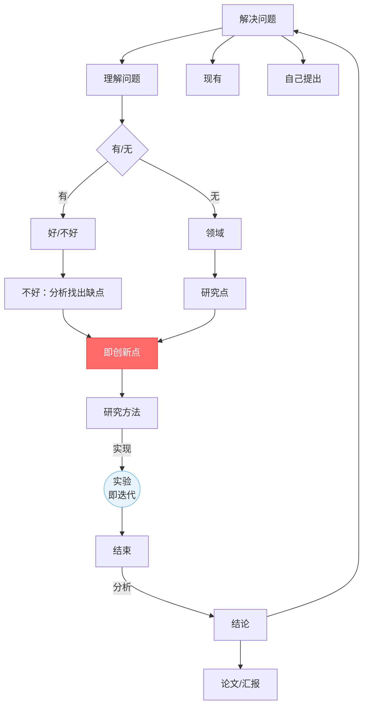
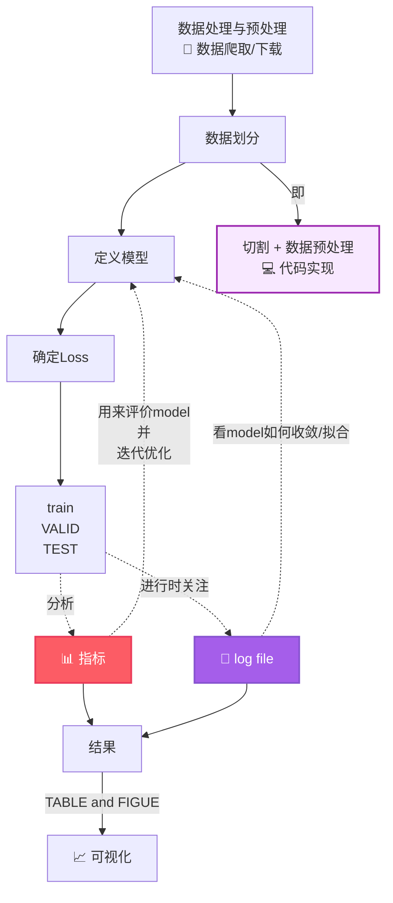

# 第二次培训学习报告


> **课程**：研究生培训课
> **提交格式**：Markdown
> **作业内容**：7.22 & 7.24课堂内容回顾/ Git基本操作和远程仓库 / 实验环境及Linux环境下的基本使用 / 现有的模型架构及使用/机器学习/python下怎么使用numpy和scipy/现有的AI模型分类/matlab使用
> **报告人**：刘欣雨

---

## 目录

- [第二次培训学习报告](#第二次培训学习报告)
  - [目录](#目录)
- [第一部分：课堂知识回顾](#第一部分课堂知识回顾)
  - [一、工具简述](#一工具简述)
  - [二、科研闭环与AI实验体系](#二科研闭环与ai实验体系)
    - [2.1 科研闭环](#21-科研闭环)
    - [2.2 三类迭代](#22-三类迭代)
    - [2.3 实验体系六要素](#23-实验体系六要素)
  - [三、科研核心能力](#三科研核心能力)
    - [3.1 编程能力](#31-编程能力)
      - [3.1.1一套完整的人工智能代码流程](#311一套完整的人工智能代码流程)
      - [3.1.3 实现工具（python下）](#313-实现工具python下)
      - [3.1.4 人工智能的数据类型](#314-人工智能的数据类型)
    - [3.2 代码复现能力](#32-代码复现能力)
    - [3.3 数据处理能力](#33-数据处理能力)
      - [3.3.1 数据划分](#331-数据划分)
      - [3.3.2 数据泄露](#332-数据泄露)
    - [3.4 工具使用能力](#34-工具使用能力)
    - [3.5 结果分析能力](#35-结果分析能力)
      - [3.5.1 模型的指标](#351-模型的指标)
      - [3.5.2 消融实验](#352-消融实验)
      - [3.5.3 结果可视化](#353-结果可视化)
    - [3.6 文献阅读能力](#36-文献阅读能力)
    - [3.7 写作能力](#37-写作能力)
    - [3.8 算法分析能力](#38-算法分析能力)
- [第五部分：AI模型方法体系——机器学习与深度学习](#第五部分ai模型方法体系机器学习与深度学习)
  - [一、机器学习](#一机器学习)
    - [1.1 配置环境：安装Anaconda+Pycharm](#11-配置环境安装anacondapycharm)
    - [1.2 线性回归](#12-线性回归)
    - [1.3 逻辑回归](#13-逻辑回归)
    - [1.4 KNN](#14-knn)
    - [1.5 决策树](#15-决策树)
    - [1.6 支持向量机](#16-支持向量机)
  - [二、深度学习](#二深度学习)
    - [2.1 配置深度学习环境：CPU版PyTorch+Anaconda](#21-配置深度学习环境cpu版pytorchanaconda)
    - [2.2 基本数学运算](#22-基本数学运算)
    - [2.3 线性回归](#23-线性回归)
    - [2.4 softmax回归](#24-softmax回归)
    - [2.5 多层感知机](#25-多层感知机)
    - [2.6 卷积神经网络](#26-卷积神经网络)
    - [2.7 现代卷积神经网络](#27-现代卷积神经网络)
- [第六部分：python下怎么使用numpy和scipy](#第六部分python下怎么使用numpy和scipy)
- [第七部分：画图](#第七部分画图)
  - [一、matplotlib](#一matplotlib)
  - [二、matlab](#二matlab)
  - [三、Graphviz](#三graphviz)
  
---

# 第一部分：课堂知识回顾

---

## 一、工具简述

主要讲述了**Git**、**GitHub**以及**Linux**的基本操作，详见本文档的[第二部分](#第二部分git和github)和[第三部分](#第三部分linux)。🖊

---

## 二、科研闭环与AI实验体系

### 2.1 科研闭环


*图1*


### 2.2 三类迭代
  
  ```mermaid
  flowchart LR
    A[小循环<br/>调参修bug] --> B[中循环<br/>方法设计 ↔ 实验证据] --> C[大循环<br/>问题本身重新定义]
    
    style A fill:#e8f4fd,stroke:#66b3ff
    style B fill:#fff3e0,stroke:#ffb347
    style C fill:#ffe8e8,stroke:#ff6b6b
  ```
  *图2*
>三个圈从小到大，颜色从蓝到橙到红，表示循环越来越大、回退代价越来越高。

### 2.3 实验体系六要素

| 要素 | 一句话 | 关键陷阱 |
|------|--------|---------|
| Dataset | 定义模型面对的世界 | 数据泄漏：测试集信息"漏"进训练 |
| Model | 研究假设的载体 | 容量大≠方法好，可能只是参数多 |
| Training | 优化参数的过程 | 超参数要公开，保证可复现 |
| Validation | 选模型调超参 | 频繁使用→对验证集过拟合 |
| Testing | 最终独立评估 | 只跑一次，不再根据结果改模型 |
| Metrics | 把"好"变成数字 | 指标要和研究目标一致 |

*表格2.3*

>辅以**Baseline**（最强对比）、**Ablation**（模块贡献）、**Parameter Setting** (参数对比)、**Reproducibility**（可复现）

---

## 三、科研核心能力
 
分别为：编程能力、代码复现能力、数据处理能力、工具使用能力、结果分析能力、文献阅读能力、写作能力和算法分析能力。

- **将八大能力体现在科研闭环中：**
<center>


 ```mermaid
 flowchart TD
    A[📚 文献阅读能力<br/>📖 实验复现能力] -->|找到创新点·立意| B[🔧 算法分析能力<br/>📊 数据处理能力<br/>🛠️ 工具使用能力]
    B -->|研究方法·实验| C[📊 数据处理能力<br/>📈 结果分析能力]
    C -->|得到结果| D[✍️ 写作表达能力]
    D -->|转化论文| E[📄 论文]
```
</center>
*图*

### 3.1 编程能力

编程能力主要体现在对于python的应用上。

#### 3.1.1一套完整的人工智能代码流程


>紫色方框是主线
>常见指标详见本文档[3.5 结果分析能力](#35-结果分析能力)
>TABLE and FIGUE如何用代码制作详见本文档[第八部分：画图](#第八部分画图)


  

#### 3.1.3 实现工具（python下）


| 工具 | 用途 | 示例 |
|---|---|---|
| [Numpy](https://numpy.org/) | 纯数学运算 | `np.dot(a, b)` |
| [Scipy](https://scipy.org/) | 科学计算 | `scipy.optimize.minimize()` |
| [Pytorch](https://pytorch.org/) | 深度学习 | `torch.nn.Linear(128, 64)` |

```python
import numpy as np
import scipy
import torch

# Numpy：矩阵乘法
a = np.array([[1, 2], [3, 4]])
b = np.dot(a, a)  # [[7,10],[15,22]]

# Scipy：求最小值
from scipy.optimize import minimize
res = minimize(lambda x: x**2 + 1, x0=0)

# Pytorch：定义模型
model = torch.nn.Sequential(
    torch.nn.Linear(128, 64),
    torch.nn.ReLU(),
    torch.nn.Linear(64, 10)
)
```


- Numpy（用于纯数学）


- Scipy{用于科学计算}


- Pytorch（专门用于深度学习）

#### 3.1.4 人工智能的数据类型

int8 int16  FP16 FP32 bf16 bf32 向量 矩阵 张量

gpu（CUDA）

### 3.2 代码复现能力

<center>

 ```mermaid
  flowchart TD
    A[有代码仅需要安装依赖] --> B[模型设计偏底层<br/>依靠第三方代码] --> C[有实现方法但没有源代码] -->D[只给出数学定义、数学方法和理论设计]
    
    style A fill:#e8f4fd,stroke:#66b3ff
    style B fill:#fff3e0,stroke:#ffb347
    style C fill:#ffe8e8,stroke:#ff6b6b
  ```

</center>
*复现难度依次递增*

### 3.3 数据处理能力

#### 3.3.1 数据划分

#### 3.3.2 数据泄露


### 3.4 工具使用能力

python 虚拟环境 git版本控制 Linux pytorch 

### 3.5 结果分析能力

结果分析主要通过模型的指标、消融实验进行，与此同时还要考虑如何将结果展示出来

#### 3.5.1 模型的指标

当前AI大模型的本质：分类和回归引入指标

#### 3.5.2 消融实验

#### 3.5.3 结果可视化

格式：json csv
>用来展示表:用word和latex
>用来表示数据的matplotlib以及更高级的画图工具


### 3.6 文献阅读能力

### 3.7 写作能力

### 3.8 算法分析能力


-


---


---
---
# 第五部分：AI模型方法体系——机器学习与深度学习


>机器学习是框架-方法，深度学习是顶层-工程突破。
>此部分在报告中主要以概念和原理为主，==详细实操见附件1，2==，附件1中的练习源于本科《机器学习》实验课，附件2中的练习源于《动手学深度学习-PyTorchh（第二版）》，需要用到的数据集也全都push到GitHub里。

>也可以直接点击查看[附件1_机器学习](https://nbviewer.org/github/Neon9118/Homework/blob/main/%E7%A0%940/%E5%88%98%E6%AC%A3%E9%9B%A8_%E4%BD%9C%E4%B8%9A2/Machine_Learning_test.ipynb)，[附件2_深度学习](https://nbviewer.org/github/Neon9118/Homework/blob/main/%E7%A0%940/%E5%88%98%E6%AC%A3%E9%9B%A8_%E4%BD%9C%E4%B8%9A2/Deep_learning_test.ipynb)

## 一、机器学习

### 1.1 配置环境：安装Anaconda+Pycharm


<br/>


<br/>


<br/>


<br/>

### 1.2 线性回归

- **概念**
  
- **核心原理**

- **训练评估数值**
· 概念：预测连续数值（如房价、温度）。假设输入特征与输出存在线性关系。
· 核心原理：找到一条直线（或超平面），使得所有样本点到这条线的垂直距离（残差）的平方和最小。求解方式有最小二乘法（正规方程）和梯度下降法。
· 关键注意事项：对异常值极其敏感（一个离群点能把直线带偏）；要求特征之间不能高度相关（多重共线性），否则系数不稳定；特征需做标准化/归一化（梯度下降收敛更快）。
· 训练评估指标：


<br/>


<br/>

### 1.3 逻辑回归

- **概念**
  
- **核心原理**

- **训练评估数值**

<br/>


<br/>

### 1.4 KNN

- **概念**
  
- **核心原理**

- **训练评估数值**

<br/>


### 1.5 决策树

- **概念**
  
- **核心原理**

- **训练评估数值**

<br/>

- **决策树可视化**


<br/>

### 1.6 支持向量机

- **概念**
  
- **核心原理**

- **训练评估数值**

<br/>


---


## 二、深度学习

### 2.1 配置深度学习环境：CPU版PyTorch+Anaconda


<br/>


### 2.2 基本数学运算

<br/>

### 2.3 线性回归

- **从零开始**
  
- **简洁实现**


<br/>


### 2.4 softmax回归

- **从零开始**
  
- **简洁实现**


<br/>


### 2.5 多层感知机

<br/>

- **从零开始**
  
- **简洁实现**


### 2.6 卷积神经网络


<br/>


### 2.7 现代卷积神经网络

<br/>


---

# 第六部分：python下怎么使用numpy和scipy


---

# 第七部分：画图

## 一、matplotlib

---

## 二、matlab

---

## 三、Graphviz