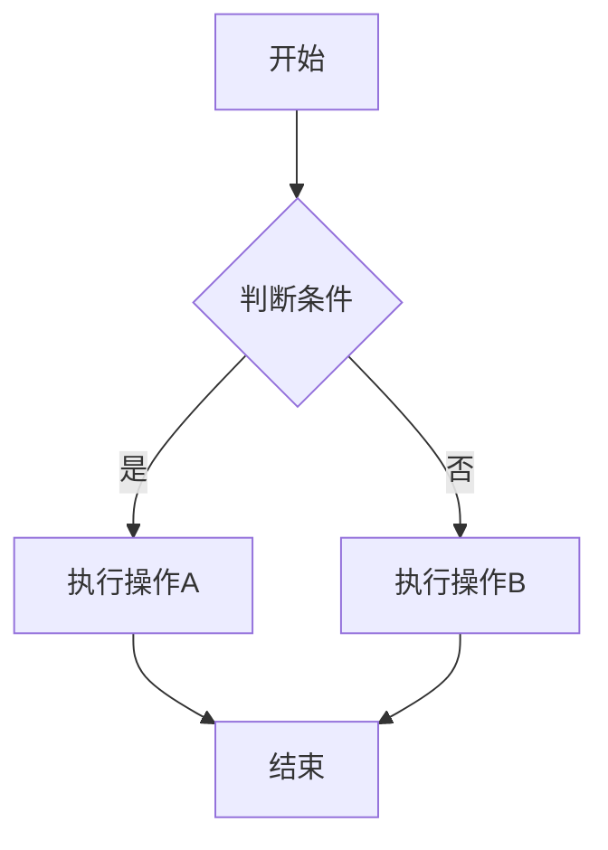
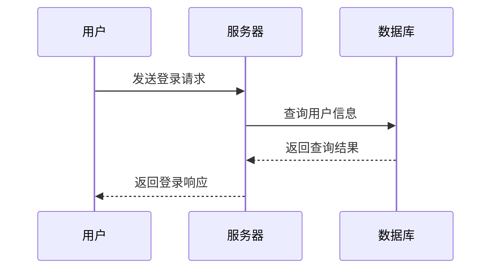
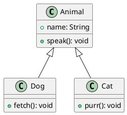

# 第一次培训学习报告


> **课程**：研究生培训课
> **提交格式**：Markdown
> **作业内容**：Linux操作系统 / Markdown学习 / LaTeX学习 / Python与C语言总结
> **报告人**：刘欣雨


---

## 目录

- [第一部分：Linux操作系统](#第一部分：linux操作系统)
  - [一、对Linux系统的理解](#一、对linux系统的理解)
  - [二、Linux速查手册](#二、linux速查手册)
- [第二部分：Markdown学习](#第二部分：markdown学习)
  - [一、Markdown简介与基本语法](#一、markdown简介与基本语法)
  - [二、CommonMark与GFM的对比](#二、commonmark与gfm的对比)
  - [三、Markdown扩展功能及速查手册](#三、markdown扩展功能及速查手册)
- [第三部分：LaTeX学习](#第三部分：latex学习)
  - [一、LaTeX基本语法总结](#一、latex基本语法总结)
  - [二、本地LaTeX环境配置](#二、本地latex环境配置)
- [第四部分：Python与C语言总结](#第四部分：python与c语言总结)
  - [一、Python知识总结](#一、python知识总结)
  - [二、C语言知识总结](#二、c语言知识总结)

---

# 第一部分：Linux操作系统

---

## 一、对Linux系统的理解

### 1.1 从Hadoop说起——我与Linux的初次接触

在本科阶段学习大数据课程时，我第一次接触到了Hadoop。Hadoop是一个分布式计算框架，被广泛用于海量数据的存储与处理。然而在搭建Hadoop集群的过程中，我发现一个不可回避的前提——**Hadoop的运行环境几乎默认是Linux**。所以对我而言，**学习Hadoop的过程，本质上也是学习Linux的过程**。

正是通过Hadoop这座桥梁，让我开始真接触Linux。它不仅仅是一个操作系统，更是一整套为分布式计算而生的工程哲学：一切皆文件、管道组合小工具、命令行驱动自动化。


*1.1 本科课程截图*


### 1.2 Linux的体系结构

Linux系统的体系结构可以自底向上分为四层：

- **内核（Kernel）**：Linux的核心，负责CPU调度、内存管理、设备驱动、文件系统及网络协议等底层资源管理，直接与硬件交互。采用宏内核设计，支持可加载内核模块（LKM），兼顾性能与扩展灵活性。

- **Shell**：用户与内核之间的命令解释器，接收并执行用户命令，返回结果。支持变量、条件判断、循环等编程特性，常见的有Bash、Zsh等，是运维自动化脚本的基础。

- **文件系统（Filesystem）**：遵循"一切皆文件"，将硬件、进程、网络等抽象为文件。采用单一目录树结构，通过VFS（虚拟文件系统）屏蔽底层差异，统一支持ext4、XFS、Btrfs等多种格式。

- **用户空间（User Space）**：运行应用程序、守护进程及系统服务。通过系统调用（syscall）向内核请求服务，内核进行权限检查。用户态与内核态隔离，保障系统稳定与安全。

>用户空间通过系统调用陷入内核，内核经文件系统/网络协议栈驱动硬件，Shell作为交互入口，VFS则统一了“一切皆文件”的访问接口。

### 1.3 Linux与Windows的区别

| 对比维度 | Linux | Windows |
|:---------:|:-------:|:---------:|
| 内核架构 | 宏内核，开源可定制 | 混合内核，闭源 |
| 文件系统 | 单一根目录`/`，一切皆文件 | 盘符分割（C:\、D:\），设备独立管理 |
| 权限模型 | 细粒度的owner/group/others三组权限 | 基于ACL的权限控制 |
| 软件安装 | 包管理器统一管理（apt/yum等） | 多为独立安装包，依赖管理较弱 |
| 命令行 | Shell功能强大，是生产力核心 | PowerShell功能增强，但生态不及Linux |

*表格1.4*

### 1.4 WSL体验——在Windows上拥抱Linux

在第一次培训会之后，因为师兄介绍了文献方面的知识，在此之前，我对看文献以及怎么高校看并没有深刻的理解。通过小红书知道了**zotero**这个管理文献的工具。我迫不及待进行了尝试，发现在zotero中可以下载插件在里面使用deepseek。


*1.5-1 zotero内部插件*


我发现deepseek-r1 可以进行本地部署，于是Docker在本地部署了DeepSeek大模型，整个过程只需要几条命令，而不需要手动配置复杂的Python环境和依赖——这正是Linux + Docker组合的强大之处。


*1.5-2 WSL体验*

---

## 二、Linux速查手册

### 2.1 文件与目录操作

| 命令 | 语法 | 含义 |
|------|------|------|
| `ls` | `ls [选项] [目录]` | 列出目录内容 |
| `cd` | `cd [目录路径]` | 切换当前工作目录 |
| `pwd` | `pwd` | 显示当前工作目录的完整路径 |
| `mkdir` | `mkdir [选项] 目录名` | 创建目录 | 
| `rm` | `rm [选项] 文件/目录` | 删除文件或目录（强制递归删除目录，⚠️谨慎使用） |
| `cp` | `cp [选项] 源 目标` | 复制文件或目录 |
| `mv` | `mv 源 目标` | 移动或重命名文件 |
| `find` | `find 路径 表达式` | 按条件查找文件 |
| `tree` | `tree [选项] [目录]` | 以树状结构显示目录 |
| `ln` | `ln [选项] 源 链接名` | 创建链接 |
| `touch` | `touch 文件名` | 创建空文件或更新时间戳 |

*表格2.1*
### 2.2 文件查看与编辑

| 命令 | 语法 | 含义 | 
|------|------|------|
| `cat` | `cat [选项] 文件` | 一次性显示文件全部内容 | 
| `less` | `less 文件` | 分页查看文件（支持上下翻页和搜索）| 
| `head` | `head [选项] 文件` | 显示文件开头若干行 | 
| `tail` | `tail [选项] 文件` | 显示文件末尾若干行 | 
| `nano` | `nano 文件` | 简易文本编辑器，适合新手 | 
| `vim` | `vim 文件` | 强大的终端文本编辑器 | 
| `grep` | `grep [选项] 模式 文件` | 在文件中搜索匹配的行 | 
| `wc` | `wc [选项] 文件` | 统计文件的行数、单词数、字节数 | 
| `diff` | `diff 文件1 文件2` | 比较两个文件的差异 | 

*表格2.2*
### 2.3 权限管理

| 命令 | 语法 | 含义 |
|------|------|------|
| `chmod` | `chmod [选项] 模式 文件` | 修改文件权限 | 
| `chown` | `chown [选项] 用户:组 文件` | 修改文件所有者和所属组 | 
| `sudo` | `sudo 命令` | 以超级用户权限执行命令 | 
| `su` | `su [用户名]` | 切换用户身份 | 
| `chgrp` | `chgrp 组名 文件` | 修改文件所属组 |

*表格2.3*
### 2.4 进程管理

| 命令 | 语法 | 含义|
|------|------|------|
| `ps` | `ps [选项]` | 查看进程信息 | 
| `top` | `top [选项]` | 实时显示进程状态和系统资源 | 
| `htop` | `htop` | 增强版top，交互更友好（需安装） |
| `kill` | `kill [信号] PID` | 向进程发送信号 |
| `killall` | `killall 进程名` | 按名称终止进程 |
| `bg` | `bg [作业号]` | 将暂停的作业放到后台运行 |
| `fg` | `fg [作业号]` | 将后台作业调到前台运行 |
| `nohup` | `nohup 命令 &` | 使命令在退出终端后继续运行 | 
| `jobs` | `jobs` | 查看当前终端的后台作业 |

*表格2.4*
### 2.5 包管理

| 命令 | 语法 | 含义 | 
|------|------|------|
| `apt update` | `sudo apt update` | 更新软件包索引（Debian/Ubuntu系） |
| `apt upgrade` | `sudo apt upgrade` | 升级已安装的软件包 | 
| `apt install` | `sudo apt install 包名` | 安装软件包 | 
| `apt remove` | `sudo apt remove 包名` | 卸载软件包（保留配置） |
| `apt purge` | `sudo apt purge 包名` | 卸载软件包并删除配置 | 
| `apt search` | `apt search 关键词` | 搜索软件包 | 
| `yum install` | `sudo yum install 包名` | 安装软件包（CentOS/RHEL系） | 
| `yum update` | `sudo yum update` | 更新所有软件包 | 

*表格2.5*
> **提示**：Ubuntu/Debian用`apt`，CentOS/RHEL用`yum`或`dnf`，WSL默认为Ubuntu系统，使用`apt`即可。

### 2.6 网络相关

| 命令 | 语法 | 含义| 
|------|------|------|
| `ping` | `ping [选项] 主机` | 测试网络连通性 | 
| `curl` | `curl [选项] URL` | 命令行HTTP客户端 | 
| `wget` | `wget [选项] URL` | 下载文件 | 
| `ssh` | `ssh 用户@主机` | 远程登录服务器 | 
| `scp` | `scp 源 目标` | 通过SSH远程复制文件 | 
| `ifconfig` / `ip` | `ip addr` | 查看网络接口信息 | 
| `netstat` / `ss` | `ss [选项]` | 查看网络连接和端口 | 

*表格2.6*

### 2.7 环境变量

| 命令 / 文件 | 语法 | 含义 | 
|------------|------|------|
| `export` | `export 变量名=值` | 设置环境变量（仅当前会话有效） | 
| `echo $变量` | `echo $变量名` | 查看环境变量的值 | 
| `PATH` | `export PATH=$PATH:新路径` | 可执行文件搜索路径 |
| `env` | `env` | 显示所有环境变量 |
| `unset` | `unset 变量名` | 删除环境变量 | 
| `~/.bashrc` | 编辑此文件 | 用户级Shell配置，每次打开终端时加载 | 
| `~/.profile` | 编辑此文件 | 用户级登录配置 |
| `/etc/environment` | 编辑此文件 | 系统级环境变量（所有用户） | 

*表格2.7*
> **永久生效方法**：在 `~/.bashrc` 中添加 `export` 语句，然后执行 `source ~/.bashrc` 使其立即生效。这样每次打开新终端都会自动加载。

> ==**以上是借助cozy以及本科课程指导资料整理的速查手册**==

---
# 第二部分：Markdown学习

---

## 一、Markdown 简介

### 1.1 对Markdown的了解

Markdown 是一种**轻量级标记语言**，一篇文章是由*semantic + formatting*组成的。Markdown可以让作者只专注于前者的创作，而不用去管形式。也可以解放双手，不用老是操控鼠标。我对它的初步理解是源于b站上的一个up主的一个[视频](https://m.bilibili.com/video/BV1bK4y1i7BY?spm_id_from=333.1391.0.0)。

### 1.2 为什么用 Markdown

| 优势 | 说明 |
|------|------|
| **简洁直观** | 语法极简，学习成本低 |
| **专注内容** | 即前文提到的semantic，写作时无需关心文本形式|

*表格1.2*

---

## 二、CommonMark 与 GFM 的对比

### 2.1 CommonMark

Markdown 原始规范仅有约 20 行描述，大量边界情况未定义，导致各解析器行为不一致——同一份文档在不同平台渲染结果可能截然不同。**CommonMark**由此衍生，目的是建立一个明确规则，同一份文档在任何CommonMark兼容器中产生相同的渲染效果。

### 2.2 GFM：GitHub 的扩展方言

**GFM（GitHub Flavored Markdown）** ，以CommonMark为底座，新增了一系列实用的扩展，对规则也宽松了一些。

### 2.3 核心差异对比

| 特性 | CommonMark | GFM |
|------|-----------|-----|
| **表格** | ❌ 不支持，原样输出 | ✅ 支持 `col` \ `col`|
| **任务列表** | ❌ 不支持 | ✅ 支持 `- [x]` / `- [ ]` |
| **删除线** | ❌ 不支持 `~~` | ✅ 支持 `~~删除线~~` → ~~删除线~~ |
| **自动链接** | 仅 `<url>` 格式 | 自动识别裸 URL，如 `https://github.com` |
| **代码块语言标识** | 不强制要求 | 建议标注语言以启用语法高亮 |
| **换行处理** | 需行末两空格或 `<br>` | 也支持行末 `\` 强制换行 |
| **HTML 块中断** | 严格规则：空行中断 HTML 块 | 稍宽松，部分场景更宽容 |
| **列表嵌套** | 严格缩进规则（2/4 空格） | 相对宽松 |
| **围栏代码块** | 支持 ` ``` ` 和 `~~~` | 支持，且语言标识后可附加元信息 |

*表格2.3*

---

## 三、Markdown 扩展功能及速查手册

### 3.1 Markdown + VS CODE

Markdown是一种非常实用的**轻量级标记语言**，它可以让用户更加轻松地编写出结构清晰、易于理解的文档。而VS Code作为一款强大的**代码编辑器**，则提供了丰富的Markdown编辑和预览功能，使得用户可以在VS Code中更加高效地编写和查看Markdown文档。


*3.1 插件下载*

### 3.2 Markdown常用速查手册及扩展功能

#### 3.2.1 Markdown常用速查手册


*3.2.1 Markdown常用符号整理*

#### 3.2.2 扩展功能

##### 3.2.2.1 数学公式（LaTex）


*3.2.2.1数学公式查询*

##### 3.2.2.2 表格

>上面两种使用均已在图3.2.1中提及
>>关于数学公式:在无伤大雅的情况下可以借助ai生成markdown公式😄👍

##### 3.2.2.3 嵌入html

当 Markdown 语法不足以表达需求时，可以直接嵌入 HTML。

- 折叠内容

###### *示例*

```html
<details>
<summary>点击展开详情</summary>

折叠的内容写在这里，Markdown 语法**仍然有效**。

</details>
```

<details>
<summary>点击展开详情</summary>

hello😄

</details>

---

- 文字颜色

###### *示例*

```html
<span style="color: red;">红色文字</span>
<span style="color: blue; font-weight: bold;">蓝色加粗</span>
```

<span style="color: red;">Hello</span>

---

- 居中

###### *示例*

```html
<center>居中显示的文字</center>
```

<center>Hello</center>

---

- 视频嵌入

###### *示例*

```html
<video src="视频URL" controls width="600"></video>
```
>把视频URL替换成相对路径，注意要把视频文件和 .md 文件放在同一目录下

##### 3.2.2.4 Mermaid 图表

- **流程图**

###### *示例*

```markdown

```


---

- **序列图**

###### *示例*

````markdown

````


---

- **甘特图**

###### *示例*


```markdown

```


> **节点形状**：`[矩形]`、`{菱形}`、`(圆角)`、`((圆形))`。箭头：`-->` 实线、`-.->` 虚线、`==>` 粗线。


##### 3.2.2.5 PlantUML

- **类图**

###### *示例*


````markdown

````


>==**以上例子只是作为我了解补充，并不能完全掌握**==

---

# 第三部分：LaTeX学习

---

## 一、LaTeX 基本语法总结

将从正文、公式、图片、表格、参考文献这五个方面对Latex的基本语法进行总结，知识点来源于b站up的这个[视频](https://m.bilibili.com/video/BV1Mc411S75c?p=1)

### 1.1 正文

#### 1.1.1 设定区域

常使用`\documentclass{...}`以及`\usepackage{...}`来设定区域，规定论文格式，导入相关依赖包等。

#### 1.1.2 正文
使用`\begin{document}....\end{document}`

###### *示例*

```latex
\documentclass{article}
\usepackage{ctex}          % 中文支持
\usepackage{amsmath}       % 数学增强
\usepackage{graphicx}      % 插图支持
\usepackage{geometry}      %页面设置

\begin{document}
hello latex
\end{document}
```

*1.1.2示例*

#### 1.1.3 其他

名称|对应
:---:|:---:
章|`chater{...}`
节|`section{...}`
小节|`subsection{...}`
小小节|`subsubsection{...}`
换行|`\\`或`\newline`
分段|`\par`
分页|`\page`
首行缩进|`setlength{\parindent}{长度}`

*表格1.1.3*

### 1.2 公式

**- 短公式**

                使用`$公式$`


*1.2-1 短公式*

**- 单行公式带编号**
###### *示例*


   ```latex
   \begin{equation}\label{公式标签}

   公式内容

   \end{equation}
   ```
   

*1.2-2 单行公式带编号*

**- 自动引用**

               使用`autoref{公式标签}`

<span style="color: red; font-weight: bold;">需要导入依赖包`\usepackage{...}`</span>


*1.2-3 自动引用*

**- 多行公式**

使用`\begin{split}...\end{split}`

>另一种方法`\begin{cases}...\end{cases}`
>>需要导入依赖包`\usepackage{amsmath}`

>需要正文样式输出的地方用`\text{}`
>对齐符`&`

###### *示例*

```latex
\documentclass{ctexart}
\usepackage{amsmath}

\begin{document}

\section{align 环境（每行独立编号）}
\begin{align}
    f(x) &= (x+1)^2 \nonumber \\
         &= x^2 + 2x + 1 \label{eq:expand} \\
    g(x) &= x^3 - 2x^2 + x \label{eq:gx}
\end{align}
其中公式~\eqref{eq:expand}是展开结果，公式~\eqref{eq:gx}是另一个函数。

\section{aligned 环境（整体一个编号）}
\begin{equation}
    \begin{aligned}
        S &= \sum_{i=1}^{n} a_i \\
          &= a_1 + a_2 + \cdots + a_n \\
          &= \frac{n(a_1 + a_n)}{2}
    \end{aligned}
    \label{eq:sum}
\end{equation}

\section{cases 环境（分段函数）}
\begin{equation}
    |x| = 
    \begin{cases}
        x,  & x \geq 0 \\
        -x, & x < 0
    \end{cases}
    \label{eq:abs}
\end{equation}

\section{split 环境（长公式换行对齐）}
\begin{equation}
    \begin{split}
        H(X) &= -\sum_{i=1}^{n} p(x_i) \log_2 p(x_i) \\
             &= -\left( \frac{1}{2}\log_2\frac{1}{2} + \frac{1}{4}\log_2\frac{1}{4} + \frac{1}{4}\log_2\frac{1}{4} \right) \\
             &= 1.5 \text{ bit}
    \end{split}
    \label{eq:entropy}
\end{equation}

\end{document}

```

*1.2-4 多行公式*


**- 无编号公式**

               
使用`\[公式]\`或`$$公式$$`

>遇到不会转换的公式：**AxMath**


*1.2善用AxMath工具生成LaTeX代码*

### 1.3 图片

**- 依赖包`graphicx`**

###### *常用模板*

```latex
\begin{figure}[htbp]
  \centering
  \includegraphicx[图片大小][图片路径]
  \caption{图片标题或说明}
  \label{图片标签}
\end{figure}
```

*1.3tex 文件中的图片*

**- 部分双栏显示的模板，如果需要图片跨栏显示则把上面的`figure`换成`figure*`**

>[图片大小]：使用`width`或者`height`来调节，单位通常为cm或者in（inch）。若只规定宽高中的一个，则保持宽高比插入。
>[图片路径]：图片相对于`.tex`文件的路径
>[htbp]:是`latex`中控制浮动位置的选项集
>>h(here):尽量将浮动体放置在代码所在位置
>>t(top):将浮动体放置在顶部
>>b(bottom):将浮动体放置在底部
>>p(page):将浮动体放置在一个单独的页面
>以上的情况可以组合使用。不提供任何选项时，默认为`tbp`。

### 1.4 表格

**- `\begin{table[htb]}`表示Table的参数**

h|here，此刻位置
:---:|:---:
t|top，置顶
b|bottom，置底

*表格1.4-1*

**- |c|是来约定表格的每列属性的**

r|right
:---:|:---:
l|left
c|center
t|top
b|bottom
p{`width`}|单元格内容向上置顶
m{`width`}|单元格上下居中（`requires array package`）
b{`width`}|单元格向下置底（`requires array package`）

*表格1.4-2*

**- 其他命令**

`&`|列分隔符
:---:|:---:
`\\`|换行
`\hline`|一条水平直线
`\newline`|在单元格内（在段落列内）新建一行
`\|`|一条垂直线
`\|\|`|两条垂直线

*表格1.4-3*


###### *示例*

*1.4 tex文件中的表格*

>==**Latex表格生成代码的网站**==
>`latex-tables.com`
>`TablesGeneratior.com`

### 1.5 参考文献

**- 直接引用：`\cite{label1}`**

>这里的label1可以随意命名，只要和文末标签对应即可

###### *示例：*

```latex
\begin{thebibliography}{99}%99表示引用上限
\bibitem{label1}引用文献1
\bibitem{label2}引用文献2
\end{thebibliography}
```


*1.5-1 tex文件中直接引用文献*

- 使用BiBTex来管理文献：设定区域添加`\bibliographystyle{unstr}`

①找到BiB格式的文献引用条目，添加至`bib`文件中

>@article{yu2019review,
title={...}
author={...}
journal={...}
volumn={...}
number={...}
pages={...}
year={...}
publisher={...}
}

②文中需要插入文献的地方用`\cite{yu2019review}`进行引用，文末参考文献的位置加`\bibliography{bib文件名}`


*1.5-2 tex文件中使用BiBTex管理文献*

**- 右上角引用**

①首先要在设定区域添加`\newcommand{\upcite}[1]{\textsuperscript{\cite{#1}}}`

②文中引用`\cite{}`改成`\upcite{}`


*1.5-3 文献右上角引用*

---

## 二、本地LaTeX环境配置

### 2.1 Tex Live 安装


*2.1验证Tex Live安装*

### 2.2 在VS Code 中配置LaTeX插件


*2.2VC Code中安装LaTeX插件*

### 2.3 测试LaTeX环境


*2.3测试LaTeX环境*

---

# 第四部分：Python与C语言总结

---

## 一、Python知识总结

### 1.1 基本数据类型


| 数据类型 | 说明 | 
|---------|------|
| `int` | 整数，无大小限制（不像C的int有范围） |
| `float` | 浮点数 | 
| `str` | 字符串，用引号包裹 | 
| `bool` | 布尔值，只有True和False | 
| `list` | 列表，可变有序序列 | 
| `tuple` | 元组，不可变有序序列 | 
| `dict` | 字典，键值对集合 |
| `set` | 集合，无序不重复元素 |

*表格1.1*

>Python的数据类型比C语言丰富得多，且不需要声明变量类型
>与C语言的对比：C只有基本类型（int/float/char）和数组，Python直接内置了列表、字典等高级结构，用起来方便很多。

### 1.2 变量与运算

python的变量不需要声明类型，赋值即创建：

```python
a = 15
b = 1.547
c = "hello python"
a, b = b, a
```

运算符`+ - * /`
>整除`//`
>幂运算`**`

### 1.3 控制流

**- 条件分支**

使用`if/elif/eles`

```python
if score >= 90:
    grade = "A"
elif score >= 60:
    grade = "B"
else:
    grade = "C"
```

**- 循环结构** 

使用`for...in/while`
```python
for i in range(5):    
    print(i)

count = 0
while count < 10:
    count += 1
```

**- 循环控制关键字**

使用`break\continue\pass`

### 1.4 函数

使用`def`定义，`return`返回值，没有`return`默认返回`none`

```python
def add(a, b):
    """返回两数之和"""    
    return a + b

result = add(3, 5)      
```

Python函数的几个特点：
- 不需要声明参数类型和返回类型
- 支持默认参数：`def greet(name, msg="你好")`
- 支持可变参数：`def sum(*args)`
- 函数可以赋值给变量、作为参数传递

### 1.5 列表与字典的常用操作

列表|字典
:---:|:---:
有序序列，靠下标找|键值映射，靠标签找东西
查找速度随着数据的增多而变慢，每次查找得从头遍历|极快，靠哈希算法

*表格1.5*

###### *示例*
```python
# 列表操作
nums = [3, 1, 4, 1, 5]
nums.append(9)          # 末尾添加
nums.sort()             # 排序
nums[0]                 # 访问第一个元素
nums[-1]                # 访问最后一个元素
len(nums)               # 长度

# 字典操作
student = {"name": "Neon", "age": 22}
student["name"]                    # 取值
student["grade"] = "研一"          # 添加/修改
for key, value in student.items(): # 遍历
    print(key, value)
```

### 1.6 文件读写

核心是`open()`

###### *示例*
```python
# 读取文件
with open("data.txt", "r", encoding="utf-8") as f:
    content = f.read()

# 写入文件
with open("output.txt", "w",encoding="utf-8") as f:
    f.write("hello world\n")
```

### 1.7 模块与包

Python通过`import`引入模块

```python
import math              # 导入整个模块
math.sqrt(2)             # 调用

from os import path      # 只导入需要的部分
path.exists("file.txt")

import numpy as np       # 起别名，社区约定
np.array([1, 2, 3])
```

>常用的第三方库：`numpy`（数值计算）、`matplotlib`（绘图）、`requests`（HTTP请求）。

---

## 二、C语言知识总结


### 2.1 基本数据类型与变量

常见的变量为`int/float/double/char`

###### *示例*
```c
int    a = 10;       
float  b = 3.14f;   
double c = 3.14;    
char   d = 'A';     
```

>C语言每个变量必须先声明类型再使用，编译器会根据类型分配固定大小的内存空间。

### 2.2 控制流

**- 条件分支**

使用`if/else if/eles`

###### *示例*

```c
if (score >= 90) {
    grade = 'A';
} else if (score >= 60) {
    grade = 'B';
} else {
    grade = 'C';
}
```

**- 循环结构** 

使用`for...in/while/do...while`

###### *示例*

```c
for (int i = 0; i < 10; i++) {
    printf("%d\n", i);
}

while (count < 10) {
    count++;
}
```

**- 循环控制关键字**

使用`break\continue`


### 2.3 函数

```c
// 函数定义
int add(int a, int b) {
    return a + b;
}

// 调用
int result = add(3, 5);
```

>C语言的函数必须声明返回类型和每个参数的类型

### 2.4 数组与字符串

```c
// 数组
int nums[5] = {3, 1, 4, 1, 5};
int len = sizeof(nums) / sizeof(nums[0]);  // 计算数组长度

// 字符串本质是char数组，以'\0'结尾
char name[] = "hello";   // 等价于 {'h','e','l','l','o','\0'}

// 字符串操作需要<string.h>
#include <string.h>
int length = strlen(name);        // 获取长度
strcpy(dest, src);                // 复制
strcmp(str1, str2);               // 比较
```

> C语言没有内置的字符串类型，字符串操作全靠库函数，而且容易出缓冲区溢出的问题。Python的`str`类型则完全不用操心这些。

### 2.5 指针——C语言的灵魂

指针存储的是内存地址

- **函数间传递大数据**：传地址比复制整个数据高效

###### *示例*
```c
int a = 42;
int *p = &a;    
*p = 100;       

printf("%d", *p);   
printf("%p", p);    
```

- **动态内存分配**：`malloc`分配堆内存，用完`free`释放

###### *示例*
```c
// 动态内存
int *arr = (int *)malloc(10 * sizeof(int)); 
arr[0] = 42;
free(arr);          
```
- **实现数据结构**：链表、树等都依赖指针

### 2.6 结构体

结构体可以把不同类型的数据组合在一起

###### *示例*
```c
struct Student {
    char name[50];
    int age;
    float score;
};

struct Student s1 = {"Neon", 22, 89.5};
printf("姓名: %s, 年龄: %d\n", s1.name, s1.age);
```

### 2.8 文件操作

- C语言的文件操作包含打开、读写（文本/二进制）、定位（随机访问）、刷新、关闭。

###### *示例*

```c
FILE *fp = fopen("data.dat", "rb+");
if (!fp) { perror("打开失败"); return -1; }

// 定位到文件末尾，获取大小
fseek(fp, 0, SEEK_END);
long size = ftell(fp);

// 定位到开头读取结构体
fseek(fp, 0, SEEK_SET);
MyData d;
if (fread(&d, sizeof(MyData), 1, fp) != 1) {
    if (ferror(fp)) perror("读取出错");
}

fclose(fp); // 顺手关掉
```

---

**以上就是本次作业的全部内容，谢谢。🐱‍💻**
