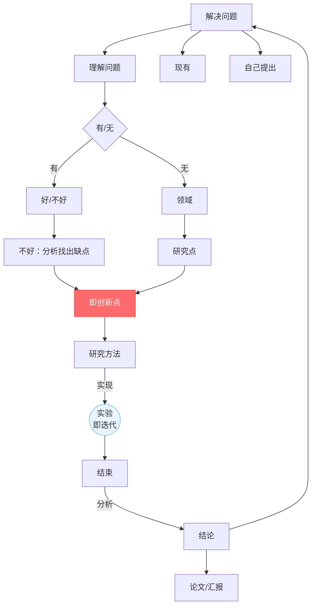
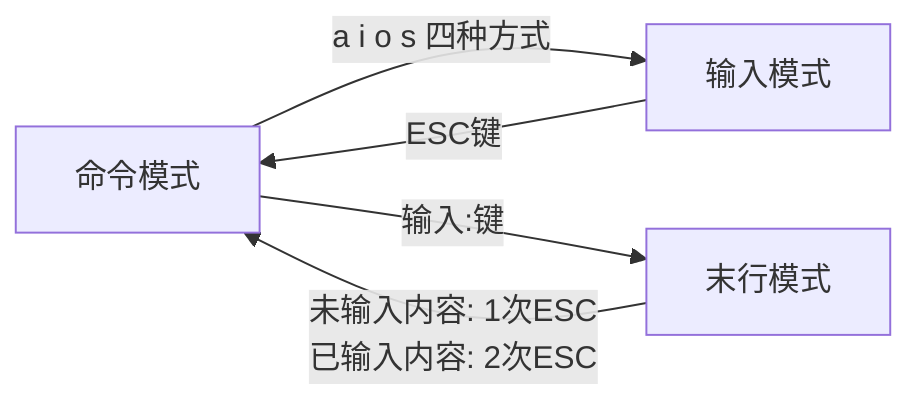
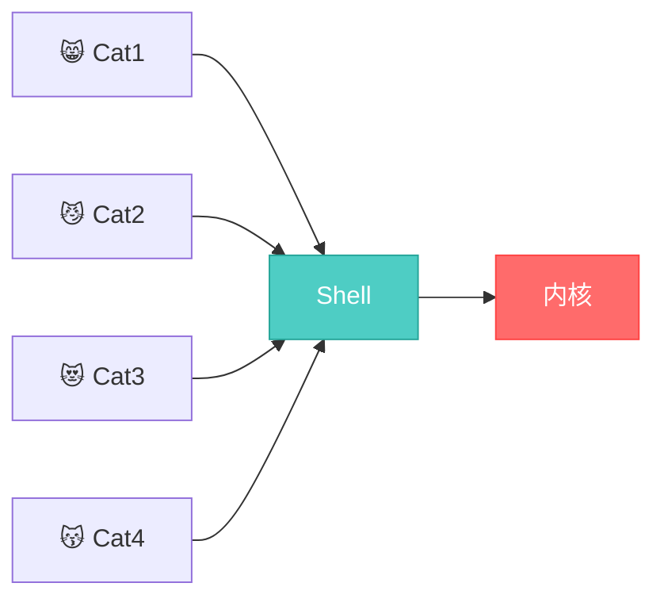

# 第二次培训学习报告


> **课程**：研究生培训课
> **提交格式**：Markdown
> **作业内容**：7.22课堂内容回顾/ Git基本操作和远程仓库 / 实验环境及Linux环境下的基本使用 / 待补充
> **报告人**：刘欣雨

---

## 目录

- [第二次培训学习报告](#第二次培训学习报告)
  - [目录](#目录)
- [第一部分：课堂知识回顾](#第一部分课堂知识回顾)
  - [一、简述](#一简述)
  - [二、科研闭环与AI实验体系](#二科研闭环与ai实验体系)
    - [2.1 科研闭环](#21-科研闭环)
    - [2.2 三类迭代](#22-三类迭代)
    - [2.3 实验体系六要素](#23-实验体系六要素)
- [第二部分：Git和GitHub](#第二部分git和github)
  - [一、Git基本操作](#一git基本操作)
    - [1.1 创建仓库](#11-创建仓库)
- [第三部分：linux](#第三部分linux)
  - [一、基础操作](#一基础操作)
  - [二、编辑器及编译语言](#二编辑器及编译语言)
    - [2.1 VI编辑器的使用](#21-vi编辑器的使用)
          - [*示例*](#示例)
          - [*示例*](#示例-1)
          - [*示例*](#示例-2)
          - [*示例*](#示例-3)
          - [*示例*](#示例-4)
          - [*示例*](#示例-5)
          - [*示例*](#示例-6)
          - [*示例*](#示例-7)
    - [2.2 GCC 编译器](#22-gcc-编译器)
    - [2.3 Shell](#23-shell)
      - [2.3.1 shell在Linux系统中的位置](#231-shell在linux系统中的位置)
    - [2.3.2 Shell编程](#232-shell编程)
        - [*示例*](#示例-8)
  - [三、实验环境](#三实验环境)
---

# 第一部分：课堂知识回顾

---

## 一、简述

上半节课主要讲述了**Git**、**GitHub**以及**Linux**的基本操作，在本篇学习报告的第二部分和第三部分会结合自己的学习内容进行详细阐述。🖊

---

## 二、科研闭环与AI实验体系

### 2.1 科研闭环


*图1*


### 2.2 三类迭代
  
  ```mermaid
  flowchart LR
    A[小循环<br/>调参修bug] --> B[中循环<br/>方法设计 ↔ 实验证据] --> C[大循环<br/>问题本身重新定义]
    
    style A fill:#e8f4fd,stroke:#66b3ff
    style B fill:#fff3e0,stroke:#ffb347
    style C fill:#ffe8e8,stroke:#ff6b6b
  ```
  *图2*
>三个圈从小到大，颜色从蓝到橙到红，表示循环越来越大、回退代价越来越高。

### 2.3 实验体系六要素

| 要素 | 一句话 | 关键陷阱 |
|------|--------|---------|
| Dataset | 定义模型面对的世界 | 数据泄漏：测试集信息"漏"进训练 |
| Model | 研究假设的载体 | 容量大≠方法好，可能只是参数多 |
| Training | 优化参数的过程 | 超参数要公开，保证可复现 |
| Validation | 选模型调超参 | 频繁使用→对验证集过拟合 |
| Testing | 最终独立评估 | 只跑一次，不再根据结果改模型 |
| Metrics | 把"好"变成数字 | 指标要和研究目标一致 |

*表格2.3*

>辅以**Baseline**（最强对比）、**Ablation**（模块贡献）、**Parameter Setting** (参数对比)、**Reproducibility**（可复现）


---
# 第二部分：Git和GitHub

---

## 一、Git基本操作

### 1.1 创建仓库

*创建仓库*


---


# 第三部分：linux

## 一、基础操作

---

## 二、编辑器及编译语言

### 2.1 VI编辑器的使用

- **使用touch创建文件`touch  1.txt`**
###### *示例*

- **使用vi打开并编辑文件`vi  1.txt`**


###### *示例*

- **vi编辑器的三种模式**


*图3*

模式|用途|示例
:---:|:---:|:---:
命令模式|默认模式，用来执行快捷操作|删除行`dd`、复制`yy`、粘贴`p`、撤销`u`等
输入模式|写代码/文字的模式，跟记事本一样打字|🈚
末行模式|执行保存退出等命令|`:w`保存、`:q`退出、`:q`保存退出、`:q!`强制退出

*表格2.1-1*

###### *示例*

- **查看文件内容`cat 1.txt`**

###### *示例*


- **显示行号在末行模式下：`set nu`**

###### *示例*

- **删除某一行**
**①** 在末行模式下：
`10d`：可删除第10行
`1,3d`：删除1-3行

###### *示例*

**②** 命令模式下`dd`

###### *示例*


- **行间跳转**
在末行模式下：①行间跳转直接输入行号 回车即可

- **翻屏**
命令模式下:

按键|含义
:---:|:---:
`Ctrl+f`|向下翻一屏
`Ctrl+b`|向上翻一屏
`Ctrl+d`|向下翻半屏
`Ctrl+u`|向上翻半屏

*表格2.1-2*

- **使用vim实现查找**
末行模式下：`/查找内容`

###### *示例*


### 2.2 GCC 编译器


### 2.3 Shell

#### 2.3.1 shell在Linux系统中的位置


*图4*

### 2.3.2 Shell编程

- **基本格式**

Shell脚本的文件名后缀通常是 .sh 

>第一行固定格式：    `#!/bin/bash`


- **打印输出命令 `echo`**
```shell
#在普通用户bao的家目录中创建shell目录
mkdir  /home/bao/shell

#在shell目录中创建firstshell.sh并编辑
vi  /home/bao/shell/firstshell.sh

#在firstshell.sh中写入代码

#!/bin/bash(此条一定要写)
echo “HELLO WORLD”

#检查firstshell.sh是否具有可执行权限
ll  /home/bao/shell


#为firstshell.sh增加可执行权限
chmod u+x /home/bao/shell/firstshell.sh

#执行firstshell.sh脚本
cd  /home/bao/shell
./firstshell.sh
```

##### *示例*

- **shell中的变量**


---

## 三、实验环境
