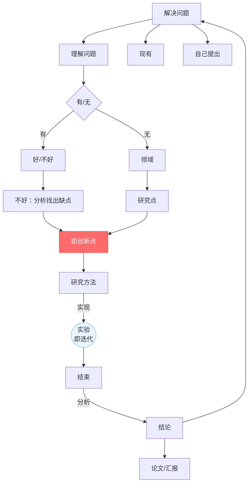

# 第二次培训学习报告


> **课程**：研究生培训课
> **提交格式**：Markdown
> **作业内容**：7.22课堂内容回顾/ Git基本操作和远程仓库 / 实验环境及Linux环境下的基本使用 / 待补充
> **报告人**：刘欣雨

---

## 目录

- [第二次培训学习报告](#第二次培训学习报告)
  - [目录](#目录)
- [第一部分：课堂知识回顾](#第一部分课堂知识回顾)
  - [一、简述](#一简述)
    - [1.1 上半节课主要讲述了GitHub和Linux的基本操作，在本篇学习报告的第二部分和第三部分会结合自己的学习内容详细阐述。](#11-上半节课主要讲述了github和linux的基本操作在本篇学习报告的第二部分和第三部分会结合自己的学习内容详细阐述)
  - [二、科研闭环与AI实验体系](#二科研闭环与ai实验体系)
    - [2.1 科研闭环](#21-科研闭环)
    - [2.2 三类迭代](#22-三类迭代)
    - [2.3 实验体系六要素](#23-实验体系六要素)
- [第二部分：Git基本操作和远程仓库](#第二部分git基本操作和远程仓库)
  - [一、Git基本操作](#一git基本操作)
    - [1.1 创建仓库](#11-创建仓库)

---

# 第一部分：课堂知识回顾

---

## 一、简述

### 1.1 上半节课主要讲述了GitHub和Linux的基本操作，在本篇学习报告的第二部分和第三部分会结合自己的学习内容详细阐述。

---

## 二、科研闭环与AI实验体系

### 2.1 科研闭环




### 2.2 三类迭代
  
  ```mermaid
  flowchart LR
    A[小循环<br/>调参修bug] --> B[中循环<br/>方法设计 ↔ 实验证据] --> C[大循环<br/>问题本身重新定义]
    
    style A fill:#e8f4fd,stroke:#66b3ff
    style B fill:#fff3e0,stroke:#ffb347
    style C fill:#ffe8e8,stroke:#ff6b6b
  ```
>三个圈从小到大，颜色从蓝到橙到红，表示循环越来越大、回退代价越来越高。

### 2.3 实验体系六要素

| 要素 | 一句话 | 关键陷阱 |
|------|--------|---------|
| Dataset | 定义模型面对的世界 | 数据泄漏：测试集信息"漏"进训练 |
| Model | 研究假设的载体 | 容量大≠方法好，可能只是参数多 |
| Training | 优化参数的过程 | 超参数要公开，保证可复现 |
| Validation | 选模型调超参 | 频繁使用→对验证集过拟合 |
| Testing | 最终独立评估 | 只跑一次，不再根据结果改模型 |
| Metrics | 把"好"变成数字 | 指标要和研究目标一致 |

*表格2.3*

>辅以**Baseline**（最强对比）、**Ablation**（模块贡献）、**Parameter Setting** (参数对比)、**Reproducibility**（可复现）


---
# 第二部分：Git基本操作和远程仓库

## 一、Git基本操作

### 1.1 创建仓库
