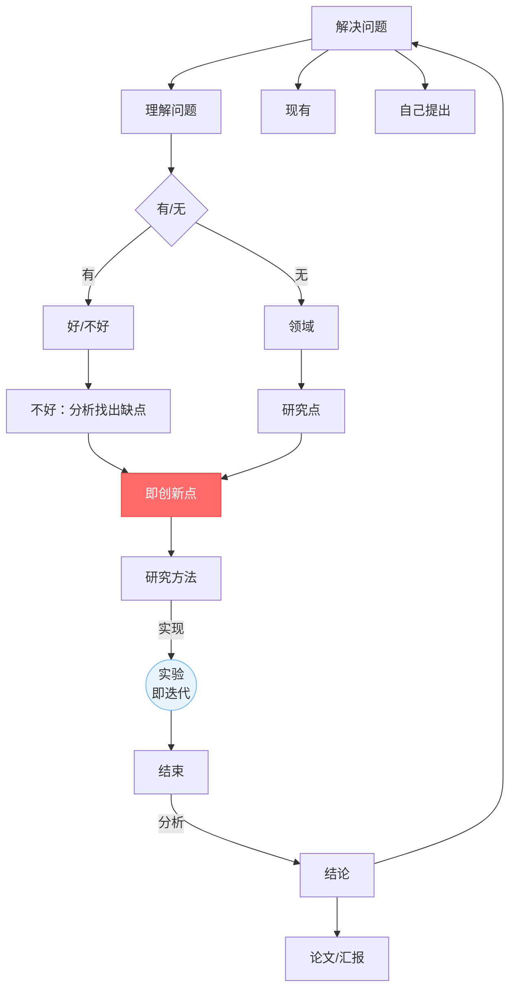
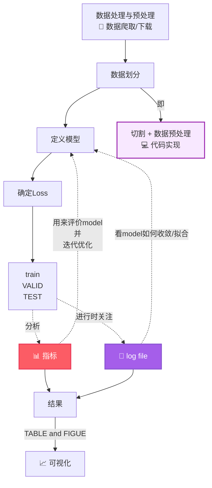
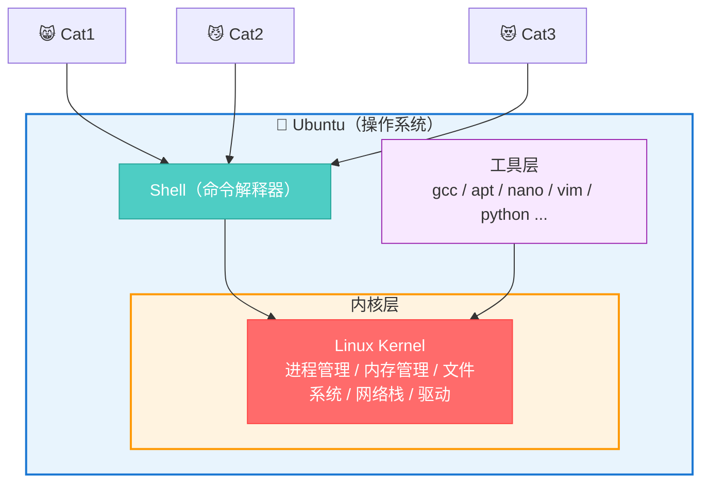
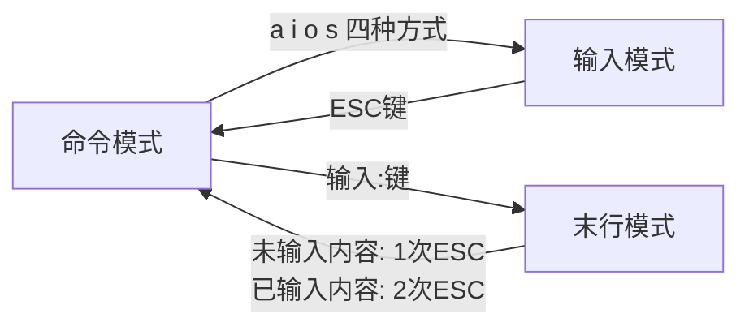
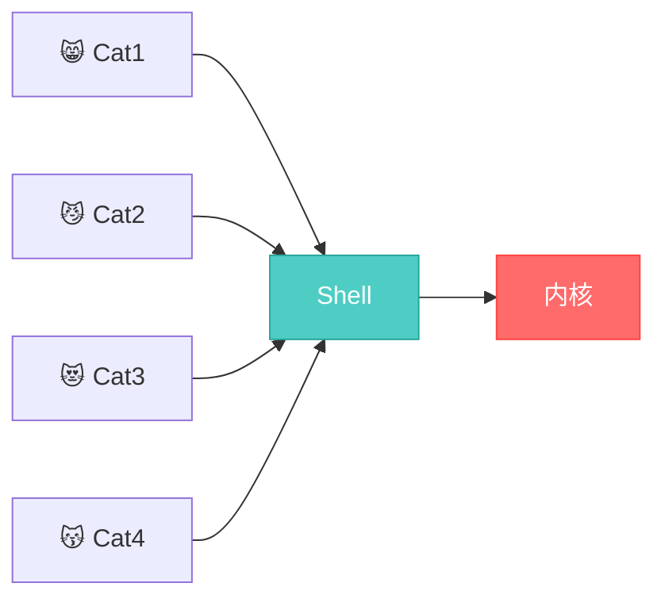

# 第二次培训学习报告


> **课程**：研究生培训课
> **提交格式**：Markdown
> **作业内容**：7.22 & 7.24课堂内容回顾/ Git基本操作和远程仓库 / 实验环境及Linux环境下的基本使用 / 现有的模型架构及使用/机器学习/python下怎么使用numpy和scipy/现有的AI模型分类/matlab使用
> **报告人**：刘欣雨

---

## 目录

- [第二次培训学习报告](#第二次培训学习报告)
  - [目录](#目录)
- [第一部分：课堂知识回顾](#第一部分课堂知识回顾)
  - [一、工具简述](#一工具简述)
  - [二、科研闭环与AI实验体系](#二科研闭环与ai实验体系)
    - [2.1 科研闭环](#21-科研闭环)
    - [2.2 三类迭代](#22-三类迭代)
    - [2.3 实验体系六要素](#23-实验体系六要素)
  - [三、科研核心能力](#三科研核心能力)
    - [3.1 编程能力](#31-编程能力)
      - [3.1.1一套完整的人工智能代码流程](#311一套完整的人工智能代码流程)
      - [3.1.3 实现工具（python下）](#313-实现工具python下)
      - [3.1.3 实现工具（python下）](#313-实现工具python下-1)
      - [3.1.4 人工智能的数据类型](#314-人工智能的数据类型)
    - [3.2 代码复现能力](#32-代码复现能力)
    - [3.3 数据处理能力](#33-数据处理能力)
      - [3.3.1 数据划分](#331-数据划分)
      - [3.3.2 数据泄露](#332-数据泄露)
    - [3.4 工具使用能力](#34-工具使用能力)
    - [3.5 结果分析能力](#35-结果分析能力)
      - [3.5.1 模型的指标](#351-模型的指标)
      - [3.5.2 消融实验](#352-消融实验)
      - [3.5.3 结果可视化](#353-结果可视化)
    - [3.6 文献阅读能力](#36-文献阅读能力)
    - [3.7 写作能力](#37-写作能力)
    - [3.8 算法分析能力](#38-算法分析能力)
- [第二部分：Git和GitHub](#第二部分git和github)
  - [一、Git基本操作](#一git基本操作)
    - [1.1 创建仓库](#11-创建仓库)
- [第三部分：虚拟系统](#第三部分虚拟系统)
  - [一、Ubuntu](#一ubuntu)
  - [二、工具层](#二工具层)
    - [2.1 micro的使用](#21-micro的使用)
    - [2.2 VIM的使用](#22-vim的使用)
          - [*示例*](#示例)
          - [*示例*](#示例-1)
          - [*示例*](#示例-2)
          - [*示例*](#示例-3)
    - [2.3 GCC的使用](#23-gcc的使用)
          - [*示例*](#示例-4)
          - [*示例*](#示例-5)
          - [*示例*](#示例-6)
  - [三、linux](#三linux)
  - [四、 Shell](#四-shell)
    - [4.1 shell与Linux的关系](#41-shell与linux的关系)
    - [4.2 Shell编程](#42-shell编程)
      - [4.2.1 **基本格式**](#421-基本格式)
      - [4.2.2 **打印输出命令 `echo`**](#422-打印输出命令-echo)
        - [*示例*](#示例-7)
      - [4.2.3 **shell中的变量**](#423-shell中的变量)
        - [*示例*](#示例-8)
      - [4.2.4 **Shell 基本运算符（+  -  \*  /  %）**](#424-shell-基本运算符---------)
        - [*示例*](#示例-9)
      - [4.2.5 **Shell 传递参数**](#425-shell-传递参数)
        - [*示例*](#示例-10)
      - [4.2.6 **传递的参数赋值给自定义变量**](#426-传递的参数赋值给自定义变量)
        - [*示例:*](#示例-11)
      - [4.2.7 **流程控制**](#427-流程控制)
      - [4.2.7 **逻辑运算符**](#427-逻辑运算符)
        - [*示例:*](#示例-12)
  - [五、实验环境](#五实验环境)
- [第四部分：现有的模型架构及使用](#第四部分现有的模型架构及使用)
- [第五部分：机器学习](#第五部分机器学习)
- [第六部分：python下怎么使用numpy和scipy](#第六部分python下怎么使用numpy和scipy)
- [第七部分：现有的AI模型分类](#第七部分现有的ai模型分类)
- [第八部分：画图](#第八部分画图)
  - [一、matplotlib](#一matplotlib)
  - [二、matlab](#二matlab)
  
---

# 第一部分：课堂知识回顾

---

## 一、工具简述

主要讲述了**Git**、**GitHub**以及**Linux**的基本操作，详见本文档的[第二部分](#第二部分git和github)和[第三部分](#第三部分linux)。🖊

---

## 二、科研闭环与AI实验体系

### 2.1 科研闭环


```mermaid
flowchart TD
    A[解决问题] --> C[理解问题]
    A --> B1[现有]
    A --> B2[自己提出]
    C --> D{有/无}
    D -->|有| E[好/不好]
    E --> F[不好：分析找出缺点]
    D -->|无| G[领域]
    G --> H[研究点]
    F --> I[即创新点]
    H --> I
    I --> J[研究方法]
    J -->|实现| K((实验<br/>即迭代))
    K --> L[结束]
    L -->|分析| M[结论]
    M --> A
    M --> N[论文/汇报]

    style I fill:#ff6b6b,color:#fff,stroke:#ff4444
    style K fill:#e8f4fd,stroke:#66b3ff
```
*图1*


### 2.2 三类迭代
  
  ```mermaid
  flowchart LR
    A[小循环<br/>调参修bug] --> B[中循环<br/>方法设计 ↔ 实验证据] --> C[大循环<br/>问题本身重新定义]
    
    style A fill:#e8f4fd,stroke:#66b3ff
    style B fill:#fff3e0,stroke:#ffb347
    style C fill:#ffe8e8,stroke:#ff6b6b
  ```
  *图2*
>三个圈从小到大，颜色从蓝到橙到红，表示循环越来越大、回退代价越来越高。

### 2.3 实验体系六要素

| 要素 | 一句话 | 关键陷阱 |
|------|--------|---------|
| Dataset | 定义模型面对的世界 | 数据泄漏：测试集信息"漏"进训练 |
| Model | 研究假设的载体 | 容量大≠方法好，可能只是参数多 |
| Training | 优化参数的过程 | 超参数要公开，保证可复现 |
| Validation | 选模型调超参 | 频繁使用→对验证集过拟合 |
| Testing | 最终独立评估 | 只跑一次，不再根据结果改模型 |
| Metrics | 把"好"变成数字 | 指标要和研究目标一致 |

*表格2.3*

>辅以**Baseline**（最强对比）、**Ablation**（模块贡献）、**Parameter Setting** (参数对比)、**Reproducibility**（可复现）

---

## 三、科研核心能力
 
分别为：编程能力、代码复现能力、数据处理能力、工具使用能力、结果分析能力、文献阅读能力、写作能力和算法分析能力。

- **将八大能力体现在科研闭环中：**
<center>


 ```mermaid
 flowchart TD
    A[📚 文献阅读能力<br/>📖 实验复现能力] -->|找到创新点·立意| B[🔧 算法分析能力<br/>📊 数据处理能力<br/>🛠️ 工具使用能力]
    B -->|研究方法·实验| C[📊 数据处理能力<br/>📈 结果分析能力]
    C -->|得到结果| D[✍️ 写作表达能力]
    D -->|转化论文| E[📄 论文]
```
</center>
*图*

### 3.1 编程能力

编程能力主要体现在对于python的应用上。

#### 3.1.1一套完整的人工智能代码流程


```mermaid
flowchart TD
    A[数据处理与预处理<br/>📝 数据爬取/下载] --> B[数据划分]
    B --> C[定义模型]
    B -->|即|D[切割 + 数据预处理<br/>💻 代码实现]

    C -->L[确定Loss]
    L-->E[train<br/>VALID<br/>TEST]

    E -.->|分析| F[📊 指标]
    E -.->|进行时关注|G[📄 log file]
    G -.->|看model如何收敛/拟合|C

    F -->H[结果]
    G -->H
    H --> |TABLE and FIGUE|I[📈 可视化]

    F -.->|用来评价model<br/>并<br/>迭代优化| C

  
   
    style D fill:#f8e8ff,stroke:#9c27b0,stroke-width:2px
    style F fill:#fc5c65,color:#fff,stroke:#eb3b5a,stroke-width:2px
    style G fill:#a55eea,color:#fff,stroke:#8854d0,stroke-width:2px
```
>紫色方框是主线
>常见指标详见本文档[3.5 结果分析能力](#35-结果分析能力)
>TABLE and FIGUE如何用代码制作详见本文档[第八部分：matlab的使用](#第八部分画图)


  

#### 3.1.3 实现工具（python下）

#### 3.1.3 实现工具（python下）

| 工具 | 用途 | 示例 |
|---|---|---|
| [Numpy](https://numpy.org/) | 纯数学运算 | `np.dot(a, b)` |
| [Scipy](https://scipy.org/) | 科学计算 | `scipy.optimize.minimize()` |
| [Pytorch](https://pytorch.org/) | 深度学习 | `torch.nn.Linear(128, 64)` |

```python
import numpy as np
import scipy
import torch

# Numpy：矩阵乘法
a = np.array([[1, 2], [3, 4]])
b = np.dot(a, a)  # [[7,10],[15,22]]

# Scipy：求最小值
from scipy.optimize import minimize
res = minimize(lambda x: x**2 + 1, x0=0)

# Pytorch：定义模型
model = torch.nn.Sequential(
    torch.nn.Linear(128, 64),
    torch.nn.ReLU(),
    torch.nn.Linear(64, 10)
)
```


- Numpy（用于纯数学）


- Scipy{用于科学计算}


- Pytorch（专门用于深度学习）

#### 3.1.4 人工智能的数据类型

int8 int16  FP16 FP32 bf16 bf32 向量 矩阵 张量

gpu（CUDA）

### 3.2 代码复现能力

<center>

 ```mermaid
  flowchart TD
    A[有代码仅需要安装依赖] --> B[模型设计偏底层<br/>依靠第三方代码] --> C[有实现方法但没有源代码] -->D[只给出数学定义、数学方法和理论设计]
    
    style A fill:#e8f4fd,stroke:#66b3ff
    style B fill:#fff3e0,stroke:#ffb347
    style C fill:#ffe8e8,stroke:#ff6b6b
  ```

</center>
*复现难度依次递增*

### 3.3 数据处理能力

#### 3.3.1 数据划分

#### 3.3.2 数据泄露


### 3.4 工具使用能力

python 虚拟环境 git版本控制 Linux pytorch 

### 3.5 结果分析能力

结果分析主要通过模型的指标、消融实验进行，与此同时还要考虑如何将结果展示出来

#### 3.5.1 模型的指标

由当前AI大模型的本质：分类和回归引入指标

#### 3.5.2 消融实验

#### 3.5.3 结果可视化

格式：json csv
>用来展示表:用word和latex
>用来表示数据的matplotlib以及更高级的画图工具


### 3.6 文献阅读能力

### 3.7 写作能力

### 3.8 算法分析能力


---
# 第二部分：Git和GitHub

---

## 一、Git基本操作

### 1.1 创建仓库

*创建仓库*


---


# 第三部分：虚拟系统

此部分将从大到小进行阐述：

<br/>


```mermaid
flowchart TB
    U1[😸 Cat1] --> S
    U2[😼 Cat2] --> S
    U3[😻 Cat3] --> S

    subgraph Ubuntu["🐧 Ubuntu（操作系统）"]
        S["Shell（命令解释器）"]
        T["工具层<br/>gcc / apt / nano / vim / python ..."]
        
        subgraph Kernel["内核层"]
            K["Linux Kernel<br/>进程管理 / 内存管理 / 文件系统 / 网络栈 / 驱动"]
        end
        
        S --> K
        T --> K
    end

    style Ubuntu fill:#e8f4fd,stroke:#1976d2,stroke-width:2px
    style Kernel fill:#fff3e0,stroke:#ff9800,stroke-width:2px
    style K fill:#ff6b6b,color:#fff,stroke:#ff4444
    style S fill:#4ecdc4,color:#fff,stroke:#26a69a
    style T fill:#f8e8ff,stroke:#9c27b0
```
*图3*


## 一、Ubuntu


**`Ubuntu = Linux内核 + 工具 + Shell + 桌面`**

Linux是Ubuntu的"发动机"，Ubuntu是包着这台发动机的"整车"。
所以：
Linux ≠ 操作系统，只是内核（发动机）
Ubuntu = Linux内核 + 一堆配套软件 = 完整的操作系统（整车）
同一个Linux内核，换个壳就是另一个系统：Ubuntu、CentOS…就像同一款发动机装不同车壳


*图1.1安装Ubuntu*

>接下来的演示，都是基于ubuntu

---

## 二、工具层

### 2.1 micro的使用
micro是一个像Windows记事本一样的终端编辑器，不用记Vim那些奇怪命令。

- **基本用法**


>像复制粘贴之类的操作与windows的记事本没区别，就不多加赘述了


### 2.2 VIM的使用

- **检查vim版本**

*图2.1-1检查vim版本*

<br/>

- **使用touch创建文件`touch  1.txt`**
- **使用vim打开并编辑文件`vi  1.txt`**

###### *示例*

*图2.1-2创建并编辑文件*

<br/>

- **vim的三种模式**


```mermaid
flowchart LR
    A[命令模式] -->|a i o s 四种方式| B[输入模式]
    B -->|ESC键| A
    A -->|输入:键| C[末行模式]
    C -->|未输入内容: 1次ESC\n已输入内容: 2次ESC| A
```
*图4*

模式|用途|示例
:---:|:---:|:---:
命令模式|默认模式，用来执行快捷操作|删除行`dd`、复制`yy`、粘贴`p`、撤销`u`等
输入模式|写代码/文字的模式，跟记事本一样打字|🈚
末行模式|执行保存退出等命令|`:w`保存、`:q`退出、`:wq`保存退出、`:q!`强制退出

*表格2.1-1*

<br/>

- **查看文件内容`cat 1.txt`**

###### *示例*


<br/>

- **显示行号在末行模式下：`set nu`**

###### *示例*


<br/>

- **删除某一行**
**①** 在末行模式下：
`10d`：可删除第10行
`1,3d`：删除1-3行

###### *示例*


**

<br/>


**


**②** 命令模式下`dd`


<br/>

- **行间跳转**
在末行模式下：①行间跳转直接输入行号 回车即可

<br/>

- **翻屏**
命令模式下:

按键|含义
:---:|:---:
`Ctrl+f`|向下翻一屏
`Ctrl+b`|向上翻一屏
`Ctrl+d`|向下翻半屏
`Ctrl+u`|向上翻半屏

*表格2.1-2*

<br/>

- **使用vim实现查找**
末行模式下：`/查找内容`


### 2.3 GCC的使用

Linux 下使用最广泛的 C/C++ 编译器是 GCC。GCC 仅仅是一个编译器，没有界面，必须在命令行模式下使用。通过gcc命令就可以将源文件编译成可执行文件。

- **查看GCC版本**


<br/>

- **一步生成可执行程序**

```shell
//进入家目录
cd ~

//创建源文件
touch  hello.c

//编辑源文件
vi  hello.c

//生成源文件对应的可执行程
gcc  hello.c

 //执行a.out.
./a.out  

```

###### *示例*


>这里的a.out只是用来表明它是 GCC 的输出文件。不管源文件的名字是什么，GCC 生成的可执行文件的默认名字始终是a.out。

<br/>

- **修改可执行文件的名字**

```shell

//如果不想使用默认的文件名，那么可以通过-o选项来自定义文件名

gcc  hello.c  –o  hello.out

//执行自定义的可执行文件

./hello.out

```

###### *示例*


<br/>

- **分步生成可执行程序**
上面讲解的是通过gcc命令一次性完成编译和链接的整个过程，这样最方便，在学习C语言的过程中一般都这么做。实际上，gcc命令也可以将编译和链接分开，每次只完成一项任务。

```shell
//预处理(同级目录下会生成hello.i)
gcc  –E  hello.c  –o  hello.i  

//编译到汇编语言(在同级目录下会生成hello.s)
//gcc  –S  hello.i  –o  hello.s 

//编译、汇编到目标代码(在同级目录下会生成hello.o)
gcc  –c  hello.s  –o  hello.o   

//生成可执行文件(在同级目录下会生成hello.out)
gcc  hello.o  –o  hello.out    

//执行hello.out
./hello.out

```
###### *示例*


<br/>

---

## 三、linux

>详见《第一次学习报告》第一部分

---

## 四、 Shell
>此部分均用vim演示

### 4.1 shell与Linux的关系


```mermaid
flowchart LR
    A1[😸 Cat1] --> B
    A2[😼 Cat2] --> B
    A3[😻 Cat3] --> B
    A4[😽 Cat4] --> B
    B[Shell] --> C[内核]
    style C fill:#ff6b6b,color:#fff,stroke:#ff4444
    style B fill:#4ecdc4,color:#fff,stroke:#26a69a
```
*图5*

### 4.2 Shell编程

#### 4.2.1 **基本格式**

Shell脚本的文件名后缀通常是 .sh 

>第一行固定格式：    `#!/bin/bash`


#### 4.2.2 **打印输出命令 `echo`**
```shell
#在普通用户neon的家目录中创建shell目录
mkdir  /home/neon/shell

#在shell目录中创建firstshell.sh并编辑
vi  /home/neon/shell/firstshell.sh

#在firstshell.sh中写入代码

#!/bin/bash(此条一定要写)
echo “HELLO WORLD”

#检查firstshell.sh是否具有可执行权限
ll  /home/neon/shell


#为firstshell.sh增加可执行权限
chmod u+x /home/neon/shell/firstshell.sh

#执行firstshell.sh脚本
cd  /home/neon/shell
./firstshell.sh
```

##### *示例*


#### 4.2.3 **shell中的变量**


>Linux Shell 中的变量分为系统变量和用户自定义变量。
>>系统变量顾名思义就是系统已经设置好的变量，诸如 `$HOME`、`$PWD`、`$USER`、`$SHELL` 等都是系统变量。
>>自定义变量，基本语法如下：
>>变量名称=值
>><br/>
>>变量不需要声明，初始化不需要指定类型
>>变量命名规则
>>>1、只能使用数字，字母和下划线，且不能以数字开头
>>>2、变量名区分大小写
>>>3、中间不能有空格，可以使用下划线 _，不能使用标点符号
>>><br/>

```shell
//在firstshell脚本下编写以下内容

my_name=”liuxinyu”
str=‘this is a string’
my_major="Computer Technology"
str1=$str

echo  “my name is ${my_name}”
echo  “my height is ${my_he}”

```


##### *示例*


<br/>

#### 4.2.4 **Shell 基本运算符（+  -  \*  /  %）**
原生bash不支持简单的数学运算，expr 是一款表达式计算工具，使用它能完成表达式的求值操作。

```shell
//在firstshell脚本下编写以下内容

#!/bin/bash
val1=`expr 2 + 2`
echo "2 + 2 = ${val1}"

val2=`expr 2 - 2`
echo "2 - 2 = ${val2}"

val3=`expr 2 / 2`
echo "2 + 2 = ${val3}"

val4=`expr 2 \* 2`
echo "2 * 2 = ${val4}"

val5=`expr 2 % 2`
echo "2 % 2 = ${val5}"

```
##### *示例*


>•	表达式和运算符之间要有空格，例如 2+2 是不对的，必须写成 2 + 2，这与我们熟悉的大多数编程语言不一样。
>•	完整的表达式要被 ` ` 包含，注意这个字符不是常用的单引号，在 Esc 键下边。

<br/>

#### 4.2.5 **Shell 传递参数**

```shell

//在firstshell脚本下编写以下内容
echo "first num：$1"
echo "second num：$2"

```
##### *示例*


<br/>

#### 4.2.6 **传递的参数赋值给自定义变量**

```shell
//在firstshell脚本下编写以下内容

#!/bin/bash
a=$1
b=$2
result=`expr $a \* $b`
echo "${a} * ${b} = ${result}"

```
##### *示例:*


<br/>

#### 4.2.7 **流程控制**

```shell

//单分支if
 if [ 条件判断式 ]
then
代码
fi

//双分支if-else
if [ 条件判断式 ]
then
代码
else
代码
fi


//分支if-elif-else
if [ 条件判断式 ]
then
代码
elif [ 条件判断式 ]
then
代码
else
代码
fi

```

#### 4.2.7 **逻辑运算符**

符号|含义
:---:|:---:
`-lt`|小于
`-le`|小于等于
`-eq`|等于
`-gt`|大于
`-ge`|大于等于
`-ne`|不等于

##### *示例:*

- **判断两个整数是否相等**

```shell
//在firstshell脚本下编写以下内容

#!/bin/bash
a=$1
b=$2
if [ $a -eq $b ]; then
    echo "${a} 等于 ${b}"
else
    echo "${a} 不等于 ${b}"
fi
```


<br/>


- **比较两个整数的大小关系**

```shell
//在firstshell脚本下编写以下内容

#!/bin/bash
a=$1
b=$2
if [ $a -gt $b ]; then
    echo "${a} 大于 ${b}"
elif [ $a -lt $b ]; then
    echo "${a} 小于 ${b}"
else
    echo "${a} 等于 ${b}"
fi
```


<br/>

- **成绩等级判断**

```shell
//在firstshell脚本下编写以下内容

#!/bin/bash
grade=$1
if [ $grade -eq 100 ]; then
    echo "congratulation!!!!"
elif [ $grade -ge 90 ]; then
    echo "your grade is A"
elif [ $grade -ge 80 ]; then
    echo "your grade is B"
elif [ $grade -ge 70 ]; then
    echo "your grade is C"
elif [ $grade -ge 60 ]; then
    echo "your grade is D"
else
    echo "your grade is E"
fi

```


<br/>

---
## 五、实验环境

Ubuntu里自带Python3


---

# 第四部分：现有的模型架构及使用

---
# 第五部分：机器学习

---

# 第六部分：python下怎么使用numpy和scipy

---

# 第七部分：现有的AI模型分类

---

# 第八部分：画图

## 一、matplotlib

---

## 二、matlab