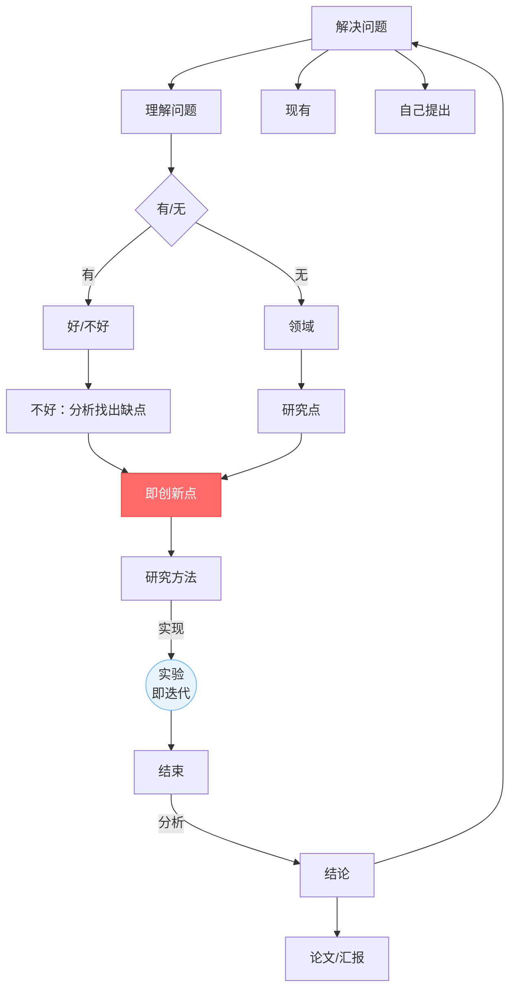
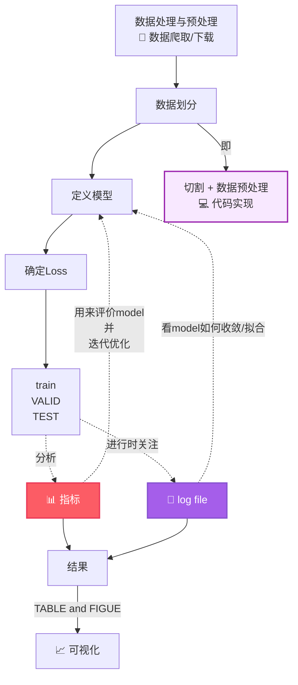
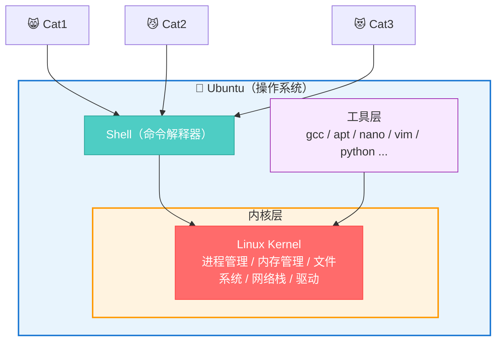
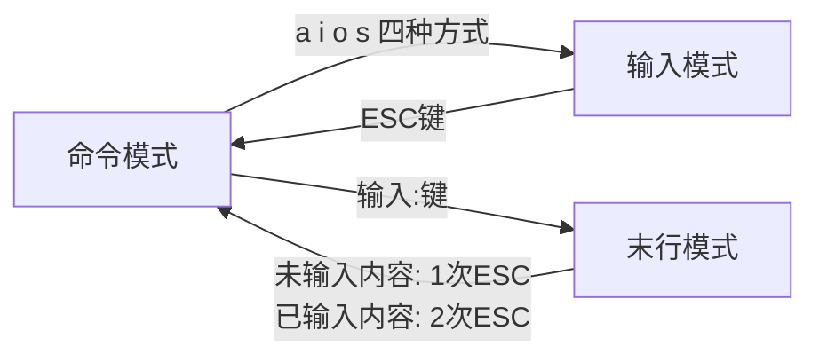
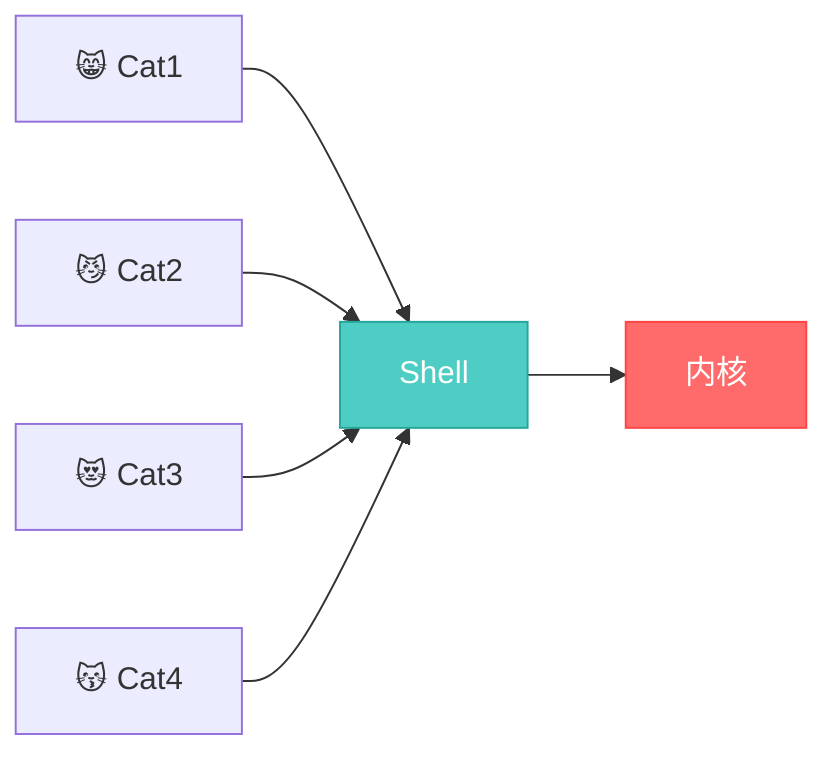

# 第二次培训学习报告


> **课程**：研究生培训课
> **提交格式**：Markdown
> **作业内容**：7.22 & 7.24课堂内容回顾/ Git基本操作和远程仓库 / 实验环境及Linux环境下的基本使用 / 现有的模型架构及使用/机器学习/python下怎么使用numpy和scipy/现有的AI模型分类/matlab使用
> **报告人**：刘欣雨

---

## 目录

- [第二次培训学习报告](#第二次培训学习报告)
  - [目录](#目录)
- [第一部分：课堂知识回顾](#第一部分课堂知识回顾)
  - [一、工具简述](#一工具简述)
  - [二、科研闭环与AI实验体系](#二科研闭环与ai实验体系)
    - [2.1 科研闭环](#21-科研闭环)
    - [2.2 三类迭代](#22-三类迭代)
    - [2.3 实验体系六要素](#23-实验体系六要素)
  - [三、科研核心能力](#三科研核心能力)
    - [3.1 编程能力](#31-编程能力)
      - [3.1.1一套完整的人工智能代码流程](#311一套完整的人工智能代码流程)
      - [3.1.3 实现工具（python下）](#313-实现工具python下)
      - [3.1.4 人工智能的数据类型](#314-人工智能的数据类型)
    - [3.2 代码复现能力](#32-代码复现能力)
    - [3.3 数据处理能力](#33-数据处理能力)
      - [3.3.1 数据划分](#331-数据划分)
      - [3.3.2 数据泄露](#332-数据泄露)
    - [3.4 工具使用能力](#34-工具使用能力)
    - [3.5 结果分析能力](#35-结果分析能力)
      - [3.5.1 模型的指标](#351-模型的指标)
      - [3.5.2 消融实验](#352-消融实验)
      - [3.5.3 结果可视化](#353-结果可视化)
    - [3.6 文献阅读能力](#36-文献阅读能力)
    - [3.7 写作能力](#37-写作能力)
    - [3.8 算法分析能力](#38-算法分析能力)
- [第二部分：Git和GitHub](#第二部分git和github)
  - [一、Repository](#一repository)
    - [1.1 工作区](#11-工作区)
    - [1.2 暂存区](#12-暂存区)
    - [1.3 本地仓库](#13-本地仓库)
  - [二、Commit](#二commit)
  - [三、Branch](#三branch)
    - [3.1 Creat](#31-creat)
    - [3.2 Merge](#32-merge)
  - [四、Remote](#四remote)
    - [4.1 代理](#41-代理)
    - [4.2 用SSH代替HTTPS](#42-用ssh代替https)
- [第三部分：虚拟系统](#第三部分虚拟系统)
  - [一、Ubuntu](#一ubuntu)
  - [二、工具层](#二工具层)
    - [2.1 micro的使用](#21-micro的使用)
    - [2.2 VIM的使用](#22-vim的使用)
          - [*示例*](#示例)
          - [*示例*](#示例-1)
          - [*示例*](#示例-2)
          - [*示例*](#示例-3)
    - [2.3 GCC的使用](#23-gcc的使用)
          - [*示例*](#示例-4)
          - [*示例*](#示例-5)
          - [*示例*](#示例-6)
  - [三、linux](#三linux)
  - [四、 Shell](#四-shell)
    - [4.1 shell与Linux的关系](#41-shell与linux的关系)
    - [4.2 Shell编程](#42-shell编程)
      - [4.2.1 **基本格式**](#421-基本格式)
      - [4.2.2 **打印输出命令 `echo`**](#422-打印输出命令-echo)
        - [*示例*](#示例-7)
      - [4.2.3 **shell中的变量**](#423-shell中的变量)
        - [*示例*](#示例-8)
      - [4.2.4 **Shell 基本运算符（+  -  \*  /  %）**](#424-shell-基本运算符---------)
        - [*示例*](#示例-9)
      - [4.2.5 **Shell 传递参数**](#425-shell-传递参数)
        - [*示例*](#示例-10)
      - [4.2.6 **传递的参数赋值给自定义变量**](#426-传递的参数赋值给自定义变量)
        - [*示例:*](#示例-11)
      - [4.2.7 **流程控制**](#427-流程控制)
      - [4.2.7 **逻辑运算符**](#427-逻辑运算符)
        - [*示例:*](#示例-12)
  - [五、实验环境](#五实验环境)
- [第四部分：AI模型架构与分类回归本质](#第四部分ai模型架构与分类回归本质)
  - [一、当前主流AI模型架构](#一当前主流ai模型架构)
  - [二、如何将模型为自己所用](#二如何将模型为自己所用)
    - [2.1 四种使用方式（由易到难）](#21-四种使用方式由易到难)
    - [2.2 三种微调方式对比](#22-三种微调方式对比)
    - [2.3 我的实践现状](#23-我的实践现状)
  - [三、为什么大模型本质是分类和回归(了解即可)](#三为什么大模型本质是分类和回归了解即可)
    - [3.1 核心论点](#31-核心论点)
    - [3.2 各类模型的本质拆解](#32-各类模型的本质拆解)
    - [3.3 总结](#33-总结)
- [第五部分：AI模型方法体系——机器学习与深度学习](#第五部分ai模型方法体系机器学习与深度学习)
  - [一、机器学习](#一机器学习)
    - [1.1 安装Anaconda和Pycharm](#11-安装anaconda和pycharm)
    - [1.2 学会使用sklearn](#12-学会使用sklearn)
          - [*示例：*](#示例-13)
          - [*示例：*](#示例-14)
    - [1.3 线性回归](#13-线性回归)
    - [1.4 逻辑回归](#14-逻辑回归)
    - [1.5 KNN](#15-knn)
    - [1.6 决策树](#16-决策树)
    - [1.7 支持向量机](#17-支持向量机)
  - [二、深度学习](#二深度学习)
- [第六部分：python下怎么使用numpy和scipy](#第六部分python下怎么使用numpy和scipy)
- [第七部分：画图](#第七部分画图)
  - [一、matplotlib](#一matplotlib)
  - [二、matlab](#二matlab)
  - [三、Graphviz](#三graphviz)
  
---

# 第一部分：课堂知识回顾

---

## 一、工具简述

主要讲述了**Git**、**GitHub**以及**Linux**的基本操作，详见本文档的[第二部分](#第二部分git和github)和[第三部分](#第三部分linux)。🖊

---

## 二、科研闭环与AI实验体系

### 2.1 科研闭环


```mermaid
flowchart TD
    A[解决问题] --> C[理解问题]
    A --> B1[现有]
    A --> B2[自己提出]
    C --> D{有/无}
    D -->|有| E[好/不好]
    E --> F[不好：分析找出缺点]
    D -->|无| G[领域]
    G --> H[研究点]
    F --> I[即创新点]
    H --> I
    I --> J[研究方法]
    J -->|实现| K((实验<br/>即迭代))
    K --> L[结束]
    L -->|分析| M[结论]
    M --> A
    M --> N[论文/汇报]

    style I fill:#ff6b6b,color:#fff,stroke:#ff4444
    style K fill:#e8f4fd,stroke:#66b3ff
```
*图1*


### 2.2 三类迭代
  
  ```mermaid
  flowchart LR
    A[小循环<br/>调参修bug] --> B[中循环<br/>方法设计 ↔ 实验证据] --> C[大循环<br/>问题本身重新定义]
    
    style A fill:#e8f4fd,stroke:#66b3ff
    style B fill:#fff3e0,stroke:#ffb347
    style C fill:#ffe8e8,stroke:#ff6b6b
  ```
  *图2*
>三个圈从小到大，颜色从蓝到橙到红，表示循环越来越大、回退代价越来越高。

### 2.3 实验体系六要素

| 要素 | 一句话 | 关键陷阱 |
|------|--------|---------|
| Dataset | 定义模型面对的世界 | 数据泄漏：测试集信息"漏"进训练 |
| Model | 研究假设的载体 | 容量大≠方法好，可能只是参数多 |
| Training | 优化参数的过程 | 超参数要公开，保证可复现 |
| Validation | 选模型调超参 | 频繁使用→对验证集过拟合 |
| Testing | 最终独立评估 | 只跑一次，不再根据结果改模型 |
| Metrics | 把"好"变成数字 | 指标要和研究目标一致 |

*表格2.3*

>辅以**Baseline**（最强对比）、**Ablation**（模块贡献）、**Parameter Setting** (参数对比)、**Reproducibility**（可复现）

---

## 三、科研核心能力
 
分别为：编程能力、代码复现能力、数据处理能力、工具使用能力、结果分析能力、文献阅读能力、写作能力和算法分析能力。

- **将八大能力体现在科研闭环中：**
<center>


 ```mermaid
 flowchart TD
    A[📚 文献阅读能力<br/>📖 实验复现能力] -->|找到创新点·立意| B[🔧 算法分析能力<br/>📊 数据处理能力<br/>🛠️ 工具使用能力]
    B -->|研究方法·实验| C[📊 数据处理能力<br/>📈 结果分析能力]
    C -->|得到结果| D[✍️ 写作表达能力]
    D -->|转化论文| E[📄 论文]
```
</center>
*图*

### 3.1 编程能力

编程能力主要体现在对于python的应用上。

#### 3.1.1一套完整的人工智能代码流程


```mermaid
flowchart TD
    A[数据处理与预处理<br/>📝 数据爬取/下载] --> B[数据划分]
    B --> C[定义模型]
    B -->|即|D[切割 + 数据预处理<br/>💻 代码实现]

    C -->L[确定Loss]
    L-->E[train<br/>VALID<br/>TEST]

    E -.->|分析| F[📊 指标]
    E -.->|进行时关注|G[📄 log file]
    G -.->|看model如何收敛/拟合|C

    F -->H[结果]
    G -->H
    H --> |TABLE and FIGUE|I[📈 可视化]

    F -.->|用来评价model<br/>并<br/>迭代优化| C

  
   
    style D fill:#f8e8ff,stroke:#9c27b0,stroke-width:2px
    style F fill:#fc5c65,color:#fff,stroke:#eb3b5a,stroke-width:2px
    style G fill:#a55eea,color:#fff,stroke:#8854d0,stroke-width:2px
```
>紫色方框是主线
>常见指标详见本文档[3.5 结果分析能力](#35-结果分析能力)
>TABLE and FIGUE如何用代码制作详见本文档[第八部分：画图](#第八部分画图)


  

#### 3.1.3 实现工具（python下）


| 工具 | 用途 | 示例 |
|---|---|---|
| [Numpy](https://numpy.org/) | 纯数学运算 | `np.dot(a, b)` |
| [Scipy](https://scipy.org/) | 科学计算 | `scipy.optimize.minimize()` |
| [Pytorch](https://pytorch.org/) | 深度学习 | `torch.nn.Linear(128, 64)` |

```python
import numpy as np
import scipy
import torch

# Numpy：矩阵乘法
a = np.array([[1, 2], [3, 4]])
b = np.dot(a, a)  # [[7,10],[15,22]]

# Scipy：求最小值
from scipy.optimize import minimize
res = minimize(lambda x: x**2 + 1, x0=0)

# Pytorch：定义模型
model = torch.nn.Sequential(
    torch.nn.Linear(128, 64),
    torch.nn.ReLU(),
    torch.nn.Linear(64, 10)
)
```


- Numpy（用于纯数学）


- Scipy{用于科学计算}


- Pytorch（专门用于深度学习）

#### 3.1.4 人工智能的数据类型

int8 int16  FP16 FP32 bf16 bf32 向量 矩阵 张量

gpu（CUDA）

### 3.2 代码复现能力

<center>

 ```mermaid
  flowchart TD
    A[有代码仅需要安装依赖] --> B[模型设计偏底层<br/>依靠第三方代码] --> C[有实现方法但没有源代码] -->D[只给出数学定义、数学方法和理论设计]
    
    style A fill:#e8f4fd,stroke:#66b3ff
    style B fill:#fff3e0,stroke:#ffb347
    style C fill:#ffe8e8,stroke:#ff6b6b
  ```

</center>
*复现难度依次递增*

### 3.3 数据处理能力

#### 3.3.1 数据划分

#### 3.3.2 数据泄露


### 3.4 工具使用能力

python 虚拟环境 git版本控制 Linux pytorch 

### 3.5 结果分析能力

结果分析主要通过模型的指标、消融实验进行，与此同时还要考虑如何将结果展示出来

#### 3.5.1 模型的指标

当前AI大模型的本质：分类和回归引入指标

#### 3.5.2 消融实验

#### 3.5.3 结果可视化

格式：json csv
>用来展示表:用word和latex
>用来表示数据的matplotlib以及更高级的画图工具


### 3.6 文献阅读能力

### 3.7 写作能力

### 3.8 算法分析能力


---
# 第二部分：Git和GitHub

---


## 一、Repository


*初始化仓库*

### 1.1 工作区


>U=Untracked未追踪，说明文件改了但还没管它

<br/>

### 1.2 暂存区


<br/>

### 1.3 本地仓库


>蓝色是指文件已经存到本地仓库中，紫色是指已经push到远程仓库

<br/>


## 二、Commit

>在提交时要简单描述，提交的标题不能是空

每次提交后会生成唯一的commit ID。可以通过`git log`命令获取


<br/>

## 三、Branch

### 3.1 Creat
因为模块的不确定性，担心加入后程序出错，可以创建新分支。待调试稳定后，合并分支加入程序。


### 3.2 Merge


---

## 四、Remote
>使用GitHub实现

### 4.1 代理
一开始我并没有设置ssh，而是用Microsoft Store 中的Watttoolkit 设置的代理，但一直push失败


### 4.2 用SSH代替HTTPS

SSH（Secure Shell） = 安全远程连接协议
>用密钥代替密码，安全地连远程服务器。

- **生成ssh公钥**


<br/>

- **在GitHub里添加New SSH Key**


<br/>

- **回VS Code 终端测试**


<br/>

- **push到远程仓库**


>SSH走22端口，这样就可以不经过代理，直接连GitHub
>以后日常操作就三步：`git add .`,`git commit -m "说明"`,`git push`
>全程不需要代理。

---


# 第三部分：虚拟系统

此部分将从大到小进行阐述：

<br/>


```mermaid
flowchart TB
    U1[😸 Cat1] --> S
    U2[😼 Cat2] --> S
    U3[😻 Cat3] --> S

    subgraph Ubuntu["🐧 Ubuntu（操作系统）"]
        S["Shell（命令解释器）"]
        T["工具层<br/>gcc / apt / nano / vim / python ..."]
        
        subgraph Kernel["内核层"]
            K["Linux Kernel<br/>进程管理 / 内存管理 / 文件系统 / 网络栈 / 驱动"]
        end
        
        S --> K
        T --> K
    end

    style Ubuntu fill:#e8f4fd,stroke:#1976d2,stroke-width:2px
    style Kernel fill:#fff3e0,stroke:#ff9800,stroke-width:2px
    style K fill:#ff6b6b,color:#fff,stroke:#ff4444
    style S fill:#4ecdc4,color:#fff,stroke:#26a69a
    style T fill:#f8e8ff,stroke:#9c27b0
```
*图3*


## 一、Ubuntu


**`Ubuntu = Linux内核 + 工具 + Shell + 桌面`**

Linux是Ubuntu的"发动机"，Ubuntu是包着这台发动机的"整车"。
所以：
Linux ≠ 操作系统，只是内核（发动机）
Ubuntu = Linux内核 + 一堆配套软件 = 完整的操作系统（整车）
同一个Linux内核，换个壳就是另一个系统：Ubuntu、CentOS…就像同一款发动机装不同车壳


*图1.1安装Ubuntu*

>接下来的演示，都是基于ubuntu

---

## 二、工具层

### 2.1 micro的使用
micro是一个像Windows记事本一样的终端编辑器，不用记Vim那些奇怪命令。

- **基本用法**


>像复制粘贴之类的操作与windows的记事本没区别，就不多加赘述了


### 2.2 VIM的使用

- **检查vim版本**

*图2.1-1检查vim版本*

<br/>

- **使用touch创建文件`touch  1.txt`**
- **使用vim打开并编辑文件`vi  1.txt`**

###### *示例*

*图2.1-2创建并编辑文件*

<br/>

- **vim的三种模式**


```mermaid
flowchart LR
    A[命令模式] -->|a i o s 四种方式| B[输入模式]
    B -->|ESC键| A
    A -->|输入:键| C[末行模式]
    C -->|未输入内容: 1次ESC\n已输入内容: 2次ESC| A
```
*图4*

模式|用途|示例
:---:|:---:|:---:
命令模式|默认模式，用来执行快捷操作|删除行`dd`、复制`yy`、粘贴`p`、撤销`u`等
输入模式|写代码/文字的模式，跟记事本一样打字|🈚
末行模式|执行保存退出等命令|`:w`保存、`:q`退出、`:wq`保存退出、`:q!`强制退出

*表格2.1-1*

<br/>

- **查看文件内容`cat 1.txt`**

###### *示例*


<br/>

- **显示行号在末行模式下：`set nu`**

###### *示例*


<br/>

- **删除某一行**
**①** 在末行模式下：
`10d`：可删除第10行
`1,3d`：删除1-3行

###### *示例*


**

<br/>


**


**②** 命令模式下`dd`


<br/>

- **行间跳转**
在末行模式下：①行间跳转直接输入行号 回车即可

<br/>

- **翻屏**
命令模式下:

按键|含义
:---:|:---:
`Ctrl+f`|向下翻一屏
`Ctrl+b`|向上翻一屏
`Ctrl+d`|向下翻半屏
`Ctrl+u`|向上翻半屏

*表格2.1-2*

<br/>

- **使用vim实现查找**
末行模式下：`/查找内容`


### 2.3 GCC的使用

Linux 下使用最广泛的 C/C++ 编译器是 GCC。GCC 仅仅是一个编译器，没有界面，必须在命令行模式下使用。通过gcc命令就可以将源文件编译成可执行文件。

- **查看GCC版本**


<br/>

- **一步生成可执行程序**

```shell
//进入家目录
cd ~

//创建源文件
touch  hello.c

//编辑源文件
vi  hello.c

//生成源文件对应的可执行程
gcc  hello.c

 //执行a.out.
./a.out  

```

###### *示例*


>这里的a.out只是用来表明它是 GCC 的输出文件。不管源文件的名字是什么，GCC 生成的可执行文件的默认名字始终是a.out。

<br/>

- **修改可执行文件的名字**

```shell

//如果不想使用默认的文件名，那么可以通过-o选项来自定义文件名

gcc  hello.c  –o  hello.out

//执行自定义的可执行文件

./hello.out

```

###### *示例*


<br/>

- **分步生成可执行程序**
上面讲解的是通过gcc命令一次性完成编译和链接的整个过程，这样最方便，在学习C语言的过程中一般都这么做。实际上，gcc命令也可以将编译和链接分开，每次只完成一项任务。

```shell
//预处理(同级目录下会生成hello.i)
gcc  –E  hello.c  –o  hello.i  

//编译到汇编语言(在同级目录下会生成hello.s)
//gcc  –S  hello.i  –o  hello.s 

//编译、汇编到目标代码(在同级目录下会生成hello.o)
gcc  –c  hello.s  –o  hello.o   

//生成可执行文件(在同级目录下会生成hello.out)
gcc  hello.o  –o  hello.out    

//执行hello.out
./hello.out

```
###### *示例*


<br/>

---

## 三、linux

>详见《第一次学习报告》第一部分

---

## 四、 Shell
>此部分均用vim演示

### 4.1 shell与Linux的关系


```mermaid
flowchart LR
    A1[😸 Cat1] --> B
    A2[😼 Cat2] --> B
    A3[😻 Cat3] --> B
    A4[😽 Cat4] --> B
    B[Shell] --> C[内核]
    style C fill:#ff6b6b,color:#fff,stroke:#ff4444
    style B fill:#4ecdc4,color:#fff,stroke:#26a69a
```
*图5*

### 4.2 Shell编程

#### 4.2.1 **基本格式**

Shell脚本的文件名后缀通常是 .sh 

>第一行固定格式：    `#!/bin/bash`


#### 4.2.2 **打印输出命令 `echo`**
```shell
#在普通用户neon的家目录中创建shell目录
mkdir  /home/neon/shell

#在shell目录中创建firstshell.sh并编辑
vi  /home/neon/shell/firstshell.sh

#在firstshell.sh中写入代码

#!/bin/bash(此条一定要写)
echo “HELLO WORLD”

#检查firstshell.sh是否具有可执行权限
ll  /home/neon/shell


#为firstshell.sh增加可执行权限
chmod u+x /home/neon/shell/firstshell.sh

#执行firstshell.sh脚本
cd  /home/neon/shell
./firstshell.sh
```

##### *示例*


#### 4.2.3 **shell中的变量**


>Linux Shell 中的变量分为系统变量和用户自定义变量。
>>系统变量顾名思义就是系统已经设置好的变量，诸如 `$HOME`、`$PWD`、`$USER`、`$SHELL` 等都是系统变量。
>>自定义变量，基本语法如下：
>>变量名称=值
>><br/>
>>变量不需要声明，初始化不需要指定类型
>>变量命名规则
>>>1、只能使用数字，字母和下划线，且不能以数字开头
>>>2、变量名区分大小写
>>>3、中间不能有空格，可以使用下划线 _，不能使用标点符号
>>><br/>

```shell
//在firstshell脚本下编写以下内容

my_name=”liuxinyu”
str=‘this is a string’
my_major="Computer Technology"
str1=$str

echo  “my name is ${my_name}”
echo  “my height is ${my_he}”

```


##### *示例*


<br/>

#### 4.2.4 **Shell 基本运算符（+  -  \*  /  %）**
原生bash不支持简单的数学运算，expr 是一款表达式计算工具，使用它能完成表达式的求值操作。

```shell
//在firstshell脚本下编写以下内容

#!/bin/bash
val1=`expr 2 + 2`
echo "2 + 2 = ${val1}"

val2=`expr 2 - 2`
echo "2 - 2 = ${val2}"

val3=`expr 2 / 2`
echo "2 + 2 = ${val3}"

val4=`expr 2 \* 2`
echo "2 * 2 = ${val4}"

val5=`expr 2 % 2`
echo "2 % 2 = ${val5}"

```
##### *示例*


>•	表达式和运算符之间要有空格，例如 2+2 是不对的，必须写成 2 + 2，这与我们熟悉的大多数编程语言不一样。
>•	完整的表达式要被 ` ` 包含，注意这个字符不是常用的单引号，在 Esc 键下边。

<br/>

#### 4.2.5 **Shell 传递参数**

```shell

//在firstshell脚本下编写以下内容
echo "first num：$1"
echo "second num：$2"

```
##### *示例*


<br/>

#### 4.2.6 **传递的参数赋值给自定义变量**

```shell
//在firstshell脚本下编写以下内容

#!/bin/bash
a=$1
b=$2
result=`expr $a \* $b`
echo "${a} * ${b} = ${result}"

```
##### *示例:*


<br/>

#### 4.2.7 **流程控制**

```shell

//单分支if
 if [ 条件判断式 ]
then
代码
fi

//双分支if-else
if [ 条件判断式 ]
then
代码
else
代码
fi


//分支if-elif-else
if [ 条件判断式 ]
then
代码
elif [ 条件判断式 ]
then
代码
else
代码
fi

```

#### 4.2.7 **逻辑运算符**

符号|含义
:---:|:---:
`-lt`|小于
`-le`|小于等于
`-eq`|等于
`-gt`|大于
`-ge`|大于等于
`-ne`|不等于

##### *示例:*

- **判断两个整数是否相等**

```shell
//在firstshell脚本下编写以下内容

#!/bin/bash
a=$1
b=$2
if [ $a -eq $b ]; then
    echo "${a} 等于 ${b}"
else
    echo "${a} 不等于 ${b}"
fi
```


<br/>


- **比较两个整数的大小关系**

```shell
//在firstshell脚本下编写以下内容

#!/bin/bash
a=$1
b=$2
if [ $a -gt $b ]; then
    echo "${a} 大于 ${b}"
elif [ $a -lt $b ]; then
    echo "${a} 小于 ${b}"
else
    echo "${a} 等于 ${b}"
fi
```


<br/>

- **成绩等级判断**

```shell
//在firstshell脚本下编写以下内容

#!/bin/bash
grade=$1
if [ $grade -eq 100 ]; then
    echo "congratulation!!!!"
elif [ $grade -ge 90 ]; then
    echo "your grade is A"
elif [ $grade -ge 80 ]; then
    echo "your grade is B"
elif [ $grade -ge 70 ]; then
    echo "your grade is C"
elif [ $grade -ge 60 ]; then
    echo "your grade is D"
else
    echo "your grade is E"
fi

```


<br/>

---
## 五、实验环境

Ubuntu里自带Python3


---

# 第四部分：AI模型架构与分类回归本质

## 一、当前主流AI模型架构

| 架构 | 代表模型 | 核心能力 | 一句话理解 |
|---|---|---|---|
| Transformer | GPT-4、BERT、LLaMA | 文本理解与生成 | 同时看整句话所有词，捕捉全局关系 |
| Diffusion | Stable Diffusion、DALL-E | 图像生成 | 从噪声中逐步去噪，还原清晰图像 |
| CNN | ResNet、EfficientNet | 图像识别与分类 | 卷积核逐块扫描，提取局部特征 |
| Mamba/SSM | Mamba、Jamba | 长序列高效处理 | 线性复杂度替代Transformer的二次复杂度 |
| MoE（混合专家） | DeepSeek、GPT-4(疑似) | 稀疏激活大模型 | 多个专家子网络，每次只激活部分，节省算力 |

---

## 二、如何将模型为自己所用

### 2.1 四种使用方式（由易到难）

| 方式 | 难度 | 原理 | 适用场景 |
|---|---|---|---|
| 调API | ⭐ | 直接调用云端接口，传入问题获取回答 | 快速验证、无需GPU |
| Prompt工程 | ⭐⭐ | 不修改模型参数，通过提示词引导输出 | 通用场景、零成本定制 |
| RAG（检索增强生成） | ⭐⭐⭐ | 外部知识库检索 + 模型生成，领域知识注入 | 企业知识问答、专业领域 |
| 微调（Fine-tuning） | ⭐⭐⭐⭐ | 用领域数据训练模型参数，改变模型行为 | 深度定制、数据充足 |

### 2.2 三种微调方式对比

| 方式 | 可训练参数量 | 显存需求 | 效果 | 适用条件 |
|---|---|---|---|---|
| 全量微调（Full） | 全部参数 | 高（多卡） | 最佳 | 数据量大、算力充足 |
| LoRA | 新增低秩矩阵 | 中（单卡可跑） | 接近全量 | 大多数微调场景 |
| QLoRA | 4bit量化 + LoRA | 低（消费级显卡） | 略低于LoRA | 显卡资源有限 |

### 2.3 我的实践现状

- 已本地部署 DeepSeek 7b 以及gemma:2b模型（对应 Prompt + RAG 层级）


<br/>


<br/>
>后续可使用 LoRA 微调，让模型深入学习三个研究方向的专业知识

---

## 三、为什么大模型本质是分类和回归(了解即可)

### 3.1 核心论点

所有监督学习任务的输出层，最终只回答两种问题：

- **分类（Classification）**：预测离散类别 → "是哪一类？"
- **回归（Regression）**：预测连续数值 → "是多少？"

### 3.2 各类模型的本质拆解

| 模型类型 | 表面任务 | 输出层实际操作 | 本质 |
|---|---|---|---|
| GPT（文本生成） | 创作文章/对话 | 从词表中选下一个词（softmax over vocabulary） | **分类**（词表大小的多分类） |
| Stable Diffusion（图像生成） | 生成图片 | 每步预测噪声数值 | **回归**（预测连续噪声值） |
| 推荐系统 | 猜你喜欢 | 预测点击概率 | **分类**（点击/不点击） |
| 自动驾驶 | 路径决策 | 预测方向盘角度/距离 | **回归**（连续数值预测） |
| BERT（情感分析） | 理解情感 | 正面/负面/中性 | **分类**（三分类） |
| 目标检测（YOLO） | 识别+定位 | 类别 + 边界框坐标 | **分类 + 回归** |

### 3.3 总结

> 不管模型中间有多少层、结构多复杂，**输出层永远在做分类或回归**。复杂的是中间的特征提取和表示学习，最终出口只有两个：标签或数值。

类比：不管工厂流水线多长多复杂，最后出货口只出两种东西——**标签**或**数字**。

---
---
# 第五部分：AI模型方法体系——机器学习与深度学习


>机器学习是框架-方法，深度学习是顶层-工程突破。

## 一、机器学习

>由于本科学习过《机器学习原理及应用》这一课程，特将课程实验与这次学习报告整合到一个文件夹中，以便之后复习使用，此章主要以介绍机器学习案例为主

### 1.1 安装Anaconda和Pycharm


<br/>


<br/>


<br/>


### 1.2 学会使用sklearn

- **sklearn机器学习包的基本使用；**


```python

from sklearn.datasets import load_iris

iris = load_iris()

x = iris.data

y = iris.target

import pandas as pd

data_df = pd.DataFrame(iris.data, columns=iris.feature_names)

data_df

```

###### *示例：*


<br/>

- 学会sklearn加载数据集；

```python
#import引入乳腺癌breast_cancer数据集
from sklearn.datasets import load_breast_cancer

#加载数据集
breast_cancer = load_breast_cancer()

#变量x存放data全部数据;变量y存放target分类数据
x = breast_cancer.data  

y = breast_cancer.target

import pandas as pd

#查看breast_cancer数据集的前5条和后5条数据
data_df = pd.DataFrame(breast_cancer.data, columns=breast_cancer.feature_names)

data_df

```

###### *示例：*


<br/>

### 1.3 线性回归

- **概念和原理**
  
  概念：线性回归是统计学习中用于建模因变量（Y）与一个或多个自变量（X）之间线性关系的预测方法。其数学形式为 Y = β₀ + β₁X₁ + ... + βₖXₖ + ε（β为系数，ε为误差项）。

  原理：核心原理是普通最小二乘法（OLS）

>找一条直线/超平面，使所有点到它的距离平方和最小


- **实践1**
假设下表是你今年每个月的生活费表，请使用线性回归预测自己第12月份的花费是多少？
（提示：模型y=wx+b，x相当于月份， w和b是需要通过建立线性回归模型训练得出的参数）


月份|金额
:---:|:---:
1|760
2|890
3|820
4|778
5|920
6|830
7|1200
8|860
9|900
10|990
11|1000
12|？


```python

from sklearn. linear_model import LinearRegression
import numpy as np

months = np. array ([1, 2, 3, 4, 5, 6, 7, 8, 9, 10, 11]).reshape (-1, 1)
expenses = np. array ([760, 890, 820, 778, 920, 830, 1200, 860, 900, 990, 1000])

#使用sklearn的linear_model.LinearRegression()方法建模
#使用fit方法拟合数据
model = LinearRegression()
model. fit (months, expenses)

print('回归系数:',model.coef_)
print ('截距:',model.intercept_)

#使用predict方法预测第12月份的花费
predicted_expense = model. predict (np. array ([[12]]))
print('预测第12个月的花费:',predicted_expense[0])

```


<br/>

- **实践2**
比较使用numpy的dot方法和使用for循环进行10000000个[0,1]之间随机数相乘的时间差


<br/>

- **实践3**
使用线性回归对加州房价进行预测，打印预测和mse均方误差，使用matplotlib绘制真实值和预测值折线图。

```python
from sklearn.datasets import fetch_california_housing

housing = fetch_california_housing()
X = housing.data
y = housing.target

# 查看数据集信息
data_df.shape
data_df.info()

# 查看统计描述
data_df.describe()

# 划分特征和标签
X = data_df.drop('MEDV', axis=1).values
y = data_df['MEDV'].values

# 划分数据集为训练集占80%，测试集占20%
X_train, X_test, y_train, y_test = train_test_split(X, y, test_size=0.2, random_state=42)

# 归一化
scaler = StandardScaler()
X_train_scaled = scaler.fit_transform(X_train)
X_test_scaled = scaler.transform(X_test)

# 建立线性回归模型
lr = LinearRegression()
lr.fit(X_train_scaled, y_train)

# 打印参数
print("Coefficients:", lr.coef_)
print("Intercept:", lr.intercept_)

# 预测
y_pred = lr.predict(X_test_scaled)

# 打印均方误差
mse = mean_squared_error(y_test, y_pred)
print("Mean Squared Error:", mse)

# 绘图
plt.scatter(y_test, y_pred)
plt.xlabel("Actual Prices")
plt.ylabel("Predicted Prices")
plt.title("Actual vs Predicted Prices")
plt.show()

```


<br/>

### 1.4 逻辑回归

- **概念和原理**
概念：逻辑回归虽名为“回归”，实则是广义线性模型下的二分类算法。它通过 Sigmoid函数:$$\sigma(x) = \frac{1}{1 + e^{-x}}$$将线性回归的输出 $z = \beta_0 + \beta_1 X_1 + \beta_2 X_2 + \cdots + \beta_k X_k$压缩到 (0,1) 区间，代表属于某一类别的概率。

原理：核心估计方法为极大似然估计（MLE）。逻辑回归不计算残差平方和，而是寻找一组参数  \beta ，使得给定样本的观测结果出现的“联合概率”（似然函数）最大。

<br/>

- **实践1**
基于逻辑回归实现乳腺癌预测，对sklearn自带的数据集breast_cancer进行乳腺癌预测,打印准确率分数
```python

from sklearn.datasets import load_breast_cancer
from sklearn.model_selection import train_test_split
from sklearn.linear_model import LogisticRegression
from sklearn.metrics import accuracy_score
import pandas as pd

# 加载数据
data = load_breast_cancer()
df = pd.DataFrame(data.data, columns=data.feature_names)
df['target'] = data.target
print(df.head())

# 划分训练集和测试集
X_train, X_test, y_train, y_test = train_test_split(
    data.data, data.target, test_size=0.2, random_state=42
)

# 建立逻辑回归模型
lr = LogisticRegression(max_iter=10000)
lr.fit(X_train, y_train)

# 预测与评估
y_pred = lr.predict(X_test)
accuracy = accuracy_score(y_test, y_pred)
print(f"乳腺癌预测准确率: {accuracy:.4f}")


```


<br/>

- **实践2**
  基于逻辑回归实现鸢尾花预测，对sklearn自带的数据集鸢尾花iris进行分类预测,打印测试集的预测结果，打印准确率分数

```python

from sklearn.datasets import load_iris
from sklearn.model_selection import train_test_split
from sklearn.preprocessing import StandardScaler
from sklearn.linear_model import LogisticRegression
from sklearn.metrics import accuracy_score
import pandas as pd

# 加载数据
data = load_iris()
df = pd.DataFrame(data.data, columns=data.feature_names)
df['target'] = data.target
print(df.head())
print(df.info())
print(df.describe())

# 划分训练集和测试集
X_train, X_test, y_train, y_test = train_test_split(
    data.data, data.target, test_size=0.2, random_state=42
)

# 归一化
scaler = StandardScaler()
X_train_scaled = scaler.fit_transform(X_train)
X_test_scaled = scaler.transform(X_test)

# 建立逻辑回归模型
lr = LogisticRegression()
lr.fit(X_train_scaled, y_train)

# 预测与评估
y_pred = lr.predict(X_test_scaled)
print(f"测试集预测结果: {y_pred}")
accuracy = accuracy_score(y_test, y_pred)
print(f"准确率: {accuracy:.4f}")

```


<br/>


<br/>

- **实践3**(拓展)
   基于逻辑回归实现泰坦尼克生存预测,打印测试集的预测结果,打印准确率accuracy_score分数


```python

import pandas as pd
from sklearn.model_selection import train_test_split
from sklearn.linear_model import LogisticRegression
from sklearn.metrics import accuracy_score

# ========== 1. 加载数据 ==========
train_df = pd.read_csv("D:/JupyterNotebook/titanictrain.csv")
train_df.info()

# ========== 2. 数据预处理 ==========

# 舍弃与生存无关的字段
train_df = train_df.drop(["PassengerId", "Name", "Ticket"], axis=1)

# Cabin字段：判断是否为空，为空则True，否则False
train_df["cabin"] = train_df["Cabin"].isna()

# Age字段：用中位数填充缺失值
train_df["Age"].fillna(train_df["Age"].median(), inplace=True)

# Embarked字段：用出现最多的港口'S'填充缺失值
train_df["Embarked"].fillna("S", inplace=True)

# 确认无缺失值
train_df.info()

# ========== 3. 特征编码 ==========

# get_dummies：将字符型转为one-hot编码
train_df = pd.get_dummies(train_df)

# ========== 4. 拆分特征和标签 ==========
train_data = train_df.drop("Survived", axis=1)
train_target = train_df["Survived"]

# 划分训练集和测试集
X_train, X_test, y_train, y_test = train_test_split(
    train_data, train_target, test_size=0.2, random_state=42
)

# ========== 5. 建立模型 ==========
model = LogisticRegression(max_iter=10000)
model.fit(X_train, y_train)

# ========== 6. 预测与评估 ==========
y_pred = model.predict(X_test)
accuracy = accuracy_score(y_test, y_pred)
print(f"泰坦尼克号生存预测准确率: {accuracy:.4f}")


```


<br/>


<br/>


<br/>

### 1.5 KNN

- **概念和原理**


<br/>

- **实践1**
  基于k近邻有监督学习实现鸢尾花分类，对sklearn自带的数据集iris鸢尾花进行分类预测选取花萼的长度和花瓣的长度作为训练集,拆分数据集为训练集和测试集，其中测试集占20%；建立KNN模型，k=3；对测试集进行预测；打印准确率accuracy_score分数，再设置k=5，对测试集进行预测，打印准确率accuracy_score分数


```python
import pandas as pd
from sklearn.datasets import load_iris
from sklearn.model_selection import train_test_split
from sklearn.neighbors import KNeighborsClassifier
from sklearn.metrics import accuracy_score

# (1) 加载iris数据集
iris = load_iris()

# (2) 使用pandas查看数据集信息
iris_df = pd.DataFrame(iris.data, columns=iris.feature_names)
iris_df['target'] = iris.target
iris_df['target_name'] = iris_df['target'].map(
    {0: 'setosa', 1: 'versicolor', 2: 'virginica'})
print("===== 鸢尾花数据集信息 =====")
print(iris_df.info())
print("\n前5行：")
print(iris_df.head())

# (3) 选取花萼长度(sepal length)和花瓣长度(petal length)作为特征
# sepal length = 第0列, petal length = 第2列
X = iris.data[:, [0, 2]]  # 取第0列和第2列
y = iris.target
print(f"\n选取的特征：花萼长度 + 花瓣长度")
print(f"特征形状: {X.shape}")

# (4) 拆分数据集，测试集占20%
X_train, X_test, y_train, y_test = train_test_split(
    X, y, test_size=0.2, random_state=42)
print(f"训练集大小: {X_train.shape[0]}, 测试集大小: {X_test.shape[0]}")

# (5) 建立KNN模型，k=3
knn_3 = KNeighborsClassifier(n_neighbors=3)

# (6) 对测试集进行预测
knn_3.fit(X_train, y_train)
y_pred_3 = knn_3.predict(X_test)

# (7) 打印准确率
acc_3 = accuracy_score(y_test, y_pred_3)
print(f"\nk=3 时准确率: {acc_3:.4f}")

# (8) 再设置k=5，预测并打印准确率
knn_5 = KNeighborsClassifier(n_neighbors=5)
knn_5.fit(X_train, y_train)
y_pred_5 = knn_5.predict(X_test)
acc_5 = accuracy_score(y_test, y_pred_5)
print(f"k=5 时准确率: {acc_5:.4f}")

```


<br/>

- **实践2**
  基于k近邻无监督学习找出鸢尾花数据聚集中的异常花朵，对sklearn自带的数据集iris鸢尾花进行异常花朵检测，选取花萼的长度和宽度作为训练集,使用matplotlib.pyplot方法画出数据集散点图,建立无监督最近邻模型（k=3）,对训练集进行fit拟合训练,使用模型的kneighbors方法得出每个点和其他3个点的距离distances,以及三个点的索引indexes，查看每个点的距离均值；使用matplotlib.pyplot 画图观测每个点的k 距离平均值；选择 >0.15 作为作为异常点，获得异常点的索引和其值;使用matplotlib.pyplot 再次画出数据集散点图，异常值设为红色点。


```python

import pandas as pd
import numpy as np
import matplotlib.pyplot as plt
from sklearn.datasets import load_iris
from sklearn.neighbors import NearestNeighbors

# 设置中文显示（防止中文标题乱码）
plt.rcParams['font.sans-serif'] = ['SimHei']
plt.rcParams['axes.unicode_minus'] = False

# (1) 加载iris数据集
iris = load_iris()

# (2) 使用pandas查看数据集信息
iris_df = pd.DataFrame(iris.data, columns=iris.feature_names)
iris_df['target'] = iris.target
print("===== 鸢尾花数据集信息 =====")
print(iris_df.info())
print("\n前5行：")
print(iris_df.head())

# (3) 选取花萼长度(sepal length)和花萼宽度(sepal width)作为训练集
# sepal length = 第0列, sepal width = 第1列
X = iris.data[:, [0, 1]]
print(f"\n选取的特征：花萼长度 + 花萼宽度")
print(f"特征形状: {X.shape}")

# (4) 画出数据集散点图
plt.figure(figsize=(8, 5))
plt.scatter(X[:, 0], X[:, 1], c=iris.target, cmap='viridis', s=50, edgecolors='k')
plt.xlabel('Sepal Length (cm)')
plt.ylabel('Sepal Width (cm)')
plt.title('Iris数据集散点图（花萼长度 vs 花萼宽度）')
plt.colorbar(label='类别')
plt.show()

# (5) 使用NearestNeighbors建立无监督最近邻模型（k=3）
nn = NearestNeighbors(n_neighbors=3)

# (6) 对训练集进行fit拟合
nn.fit(X)

# (7) kneighbors方法得出每个点和其他3个点的距离和索引
distances, indexes = nn.kneighbors(X)
print(f"\n距离数组形状: {distances.shape}")
print(f"索引数组形状: {indexes.shape}")
print(f"前5个点的距离:\n{distances[:5]}")
print(f"前5个点的邻居索引:\n{indexes[:5]}")

# (8) 查看每个点的距离均值
# 注意：第0列是自身到自身的距离(=0)，取后k个邻居的均值
# distances第0列是0（自己到自己），所以取第1列到末列求均值
mean_distances = distances[:, 1:].mean(axis=1)
print(f"\n每个点的k距离均值（前10个）：")
print(mean_distances[:10])

# (9) 画图观测每个点的k距离平均值
plt.figure(figsize=(10, 4))
plt.bar(range(len(mean_distances)), mean_distances, color='steelblue')
plt.axhline(y=0.15, color='red', linestyle='--', label='阈值=0.15')
plt.xlabel('样本索引')
plt.ylabel('k距离平均值')
plt.title('每个点的k距离平均值')
plt.legend()
plt.show()

# (10) 选择 > 0.15 作为异常点，获得异常点的索引和值
anomaly_mask = mean_distances > 0.15
anomaly_indices = np.where(anomaly_mask)[0]
anomaly_values = X[anomaly_indices]
print(f"\n异常点数量: {len(anomaly_indices)}")
print(f"异常点索引: {anomaly_indices}")
print(f"异常点值:\n{anomaly_values}")

# (11) 再次画出散点图，异常值为红色点
plt.figure(figsize=(8, 5))
# 正常点
normal_mask = ~anomaly_mask
plt.scatter(X[normal_mask, 0], X[normal_mask, 1],
            c=iris.target[normal_mask], cmap='viridis',
            s=50, edgecolors='k', label='正常点')
# 异常点（红色）
plt.scatter(anomaly_values[:, 0], anomaly_values[:, 1],
            c='red', s=100, edgecolors='k', marker='x',
            label=f'异常点({len(anomaly_indices)}个)')
plt.xlabel('Sepal Length (cm)')
plt.ylabel('Sepal Width (cm)')
plt.title('鸢尾花异常检测结果（红色×为异常点）')
plt.legend()
plt.show()

```


<br/>

### 1.6 决策树

- **概念和原理**


<br/>

- **决策树可视化**


<br/>

- **实践1** 
  基于决策树ID3算法实现鸢尾花分类，对sklearn自带的数据集iris鸢尾花进行分类预测，打印准确率accuracy_score分数，使用graphviz绘制决策树图形，决策树结点使用iris特征名称，生成id3_iris.pdf文件。


```python

import pandas as pd
from sklearn.datasets import load_iris
from sklearn.model_selection import train_test_split
from sklearn.tree import DecisionTreeClassifier, export_graphviz
from sklearn.metrics import accuracy_score
import graphviz

# (1) 加载iris数据集
iris = load_iris()

# (2) 使用pandas查看数据集信息
iris_df = pd.DataFrame(iris.data, columns=iris.feature_names)
iris_df['target'] = iris.target
iris_df['target_name'] = iris_df['target'].map({0: 'setosa', 1: 'versicolor', 2: 'virginica'})
print("===== 鸢尾花数据集信息 =====")
print(iris_df.info())
print("\n前5行：")
print(iris_df.head())

# (3) 拆分数据集，测试集占20%
X_train, X_test, y_train, y_test = train_test_split(
    iris.data, iris.target, test_size=0.2, random_state=42
)
print(f"\n训练集大小: {X_train.shape[0]}, 测试集大小: {X_test.shape[0]}")

# (4) 基于信息熵（ID3算法）建立决策树
clf_id3 = DecisionTreeClassifier(criterion='entropy', random_state=42)
clf_id3.fit(X_train, y_train)

# (5) 对测试集进行预测
y_pred = clf_id3.predict(X_test)

# (6) 打印准确率
acc = accuracy_score(y_test, y_pred)
print(f"\nID3决策树准确率: {acc:.4f}")

# (7) 使用graphviz绘制决策树，生成id3_iris.pdf
dot_data = export_graphviz(
    clf_id3,
    feature_names=iris.feature_names,
    class_names=iris.target_names,
    filled=True,
    rounded=True
)
graph = graphviz.Source(dot_data)
graph.render('id3_iris', cleanup=True)
print("决策树图形已生成: id3_iris.pdf")

```


<br/>


<br/>

- **实践2**
基于决策树算法实现葡萄酒分类，对sklearn自带的数据集wine进行分类预测，打印准确率accuracy_score分数，使用graphviz绘制决策树图形，决策树结点使用wine特征名称，生成cart_wine.pdf文件。

```python

import pandas as pd
from sklearn.datasets import load_wine
from sklearn.model_selection import train_test_split
from sklearn.tree import DecisionTreeClassifier, export_graphviz
from sklearn.metrics import accuracy_score
import graphviz

# (1) 加载wine数据集
wine = load_wine()

# (2) 使用pandas查看数据集信息
wine_df = pd.DataFrame(wine.data, columns=wine.feature_names)
wine_df['target'] = wine.target
wine_df['target_name'] = wine_df['target'].map({0: 'class_0', 1: 'class_1', 2: 'class_2'})
print("===== 葡萄酒数据集信息 =====")
print(wine_df.info())
print("\n前5行：")
print(wine_df.head())

# (3) 拆分数据集，测试集占20%
X_train, X_test, y_train, y_test = train_test_split(
    wine.data, wine.target, test_size=0.2, random_state=42
)
print(f"\n训练集大小: {X_train.shape[0]}, 测试集大小: {X_test.shape[0]}")

# (4) 基于CART算法建立决策树（criterion='gini'即CART）
clf_cart = DecisionTreeClassifier(criterion='gini', random_state=42)
clf_cart.fit(X_train, y_train)

# (5) 对测试集进行预测
y_pred = clf_cart.predict(X_test)

# (6) 打印准确率
acc = accuracy_score(y_test, y_pred)
print(f"\nCART决策树准确率: {acc:.4f}")

# (7) 使用graphviz绘制决策树，生成cart_wine.pdf
dot_data = export_graphviz(
    clf_cart,
    feature_names=wine.feature_names,
    class_names=wine.target_names,
    filled=True,
    rounded=True
)
graph = graphviz.Source(dot_data)
graph.render('cart_wine', cleanup=True)
print("决策树图形已生成: cart_wine.pdf")

```
<br/>


<br/>


<br/>


<br/>

- **实践3**(拓展)
基于决策树实现泰坦尼克生存预测，打印测试集的预测结果，打印准确率accuracy_score分数，使用graphviz绘制决策树图形，决策树结点使用字段特征名称，生成titanic.pdf文件。

```python
import pandas as pd
from sklearn.model_selection import train_test_split
from sklearn.tree import DecisionTreeClassifier, export_graphviz
from sklearn.metrics import accuracy_score
import graphviz

# (1) 读取train.csv，查看数据集信息
train_df = pd.read_csv("D:/JupyterNotebook/train.csv")
print("===== 泰坦尼克数据集信息 =====")
print(f"数据形状: {train_df.shape}")
print(train_df.head())

# (2) 使用info()查看缺失数据
print("\n===== 缺失数据情况 =====")
print(train_df.info())
print("\n各列缺失数量：")
print(train_df.isnull().sum())

# (3) 数据清洗与缺失值填充
# 删除对预测无用的列：PassengerId, Name, Ticket, Cabin（Cabin缺失太多）
train_df = train_df.drop(['PassengerId', 'Name', 'Ticket', 'Cabin'], axis=1)

# 填充Age缺失值（用中位数）
train_df['Age'] = train_df['Age'].fillna(train_df['Age'].median())

# 填充Embarked缺失值（用众数）
train_df['Embarked'] = train_df['Embarked'].fillna(train_df['Embarked'].mode()[0])

# 填充Fare缺失值（如果有）
train_df['Fare'] = train_df['Fare'].fillna(train_df['Fare'].median())

# 将Sex转为数值：male=0, female=1
train_df['Sex'] = train_df['Sex'].map({'male': 0, 'female': 1})

# 将Embarked转为数值：S=0, C=1, Q=2
train_df['Embarked'] = train_df['Embarked'].map({'S': 0, 'C': 1, 'Q': 2})

print("\n清洗后数据：")
print(train_df.head())
print(train_df.info())

# (4) 拆分训练集和测试集
X = train_df.drop('Survived', axis=1)
y = train_df['Survived']
X_train, X_test, y_train, y_test = train_test_split(
    X, y, test_size=0.2, random_state=42
)
print(f"\n训练集大小: {X_train.shape[0]}, 测试集大小: {X_test.shape[0]}")

# (5) 建立决策树模型
clf_titanic = DecisionTreeClassifier(criterion='entropy', max_depth=5, random_state=42)
clf_titanic.fit(X_train, y_train)

# (6) 对测试数据进行预测，打印预测结果
y_pred = clf_titanic.predict(X_test)
print("\n前20个预测结果：")
print(y_pred[:20])

# (7) 打印准确率
acc = accuracy_score(y_test, y_pred)
print(f"\n泰坦尼克决策树准确率: {acc:.4f}")

# (8) 使用graphviz绘制决策树，生成titanic.pdf
feature_names = X.columns.tolist()
dot_data = export_graphviz(
    clf_titanic,
    feature_names=feature_names,
    class_names=['Not Survived', 'Survived'],
    filled=True,
    rounded=True
)
graph = graphviz.Source(dot_data)
graph.render('titanic', cleanup=True)
print("决策树图形已生成: titanic.pdf")

```
<br/>


<br/>


<br/>

### 1.7 支持向量机

- **概念和原理**

<br/>

- **实践1**


```python


```

<br/>

- **实践2**

```python


```


<br/>

- **实践3**(拓展)

```python


```


---


## 二、深度学习


---

# 第六部分：python下怎么使用numpy和scipy


---

# 第七部分：画图

## 一、matplotlib

---

## 二、matlab

---

## 三、Graphviz